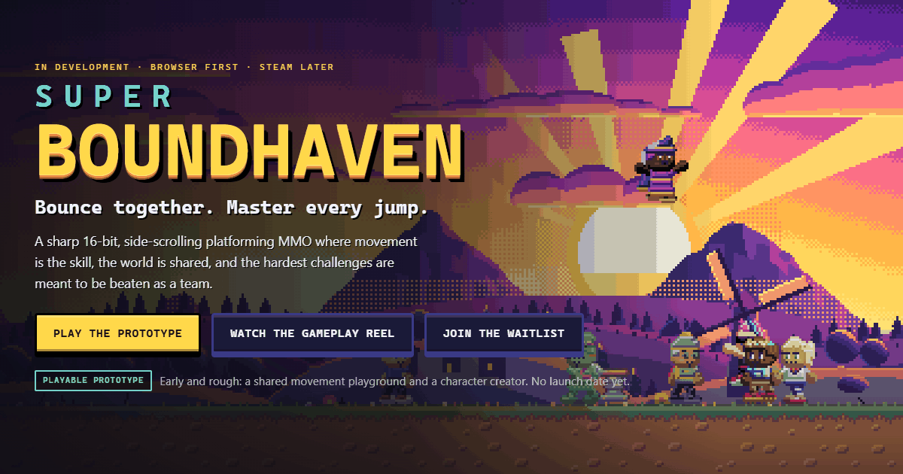
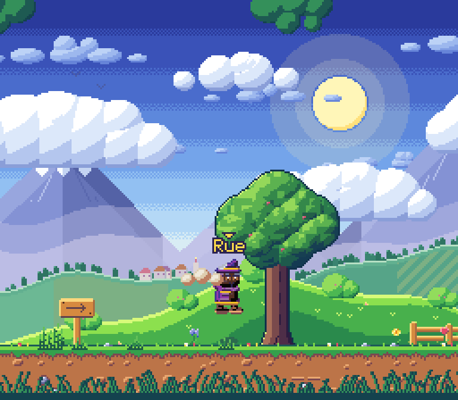
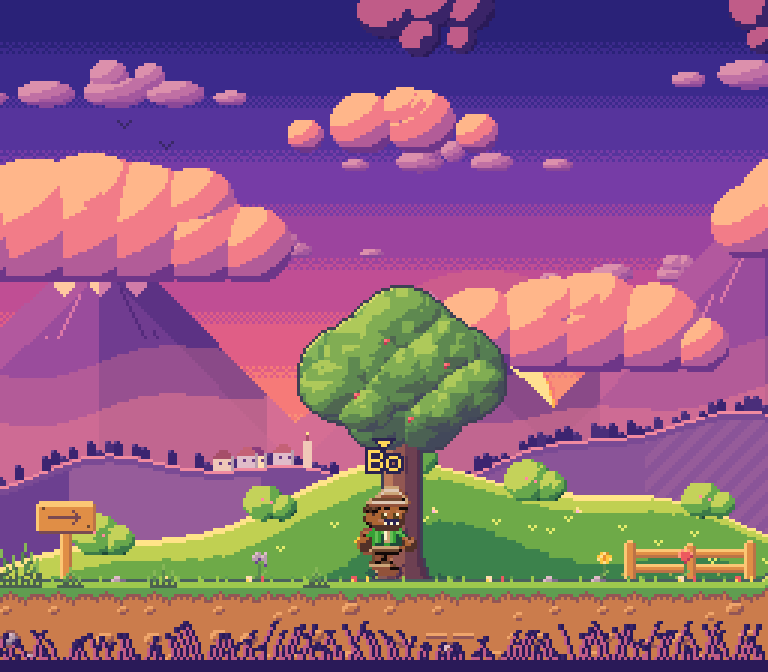
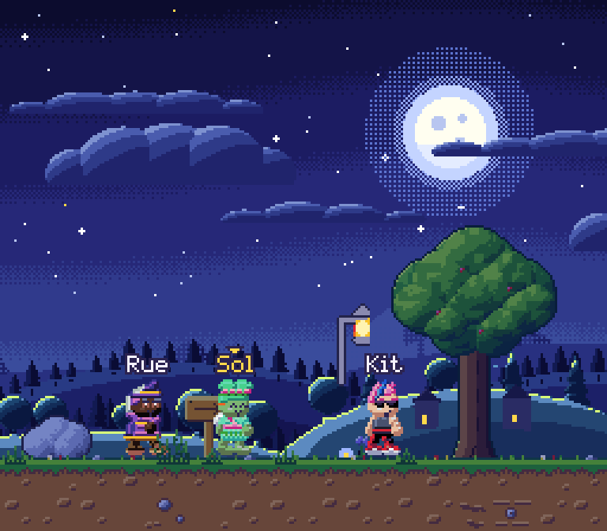
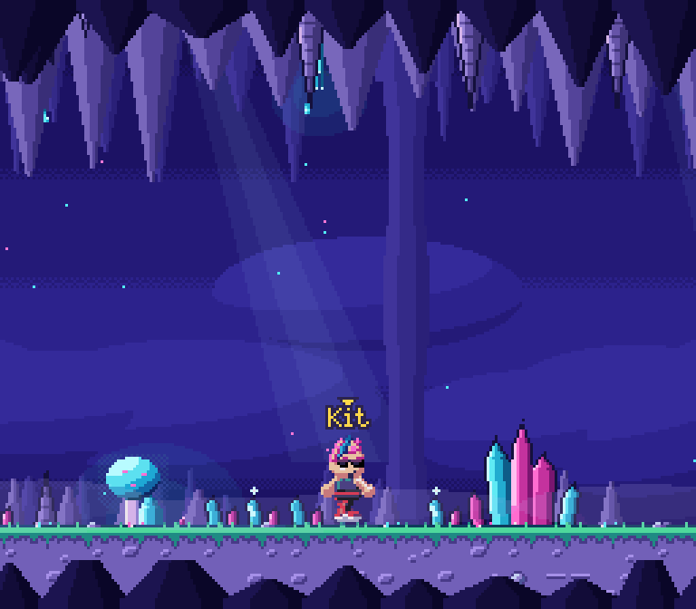
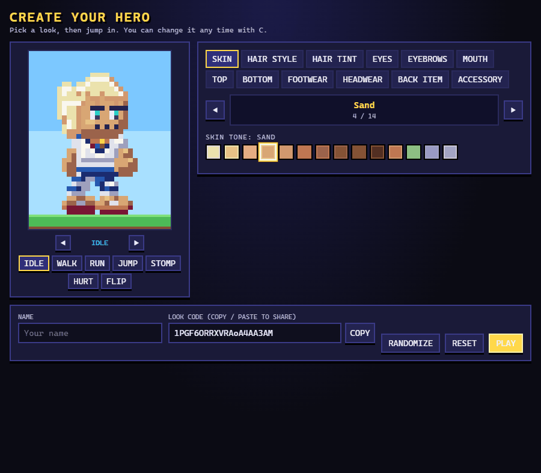
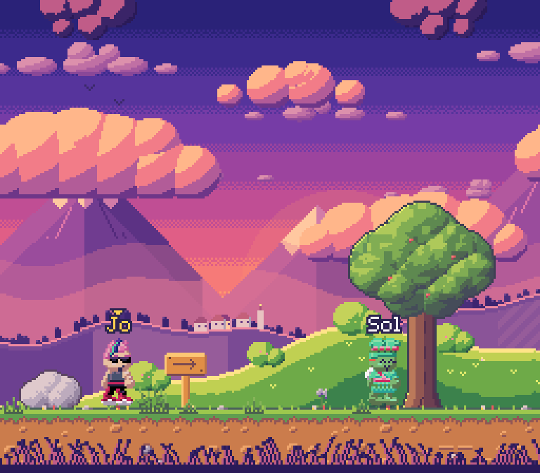
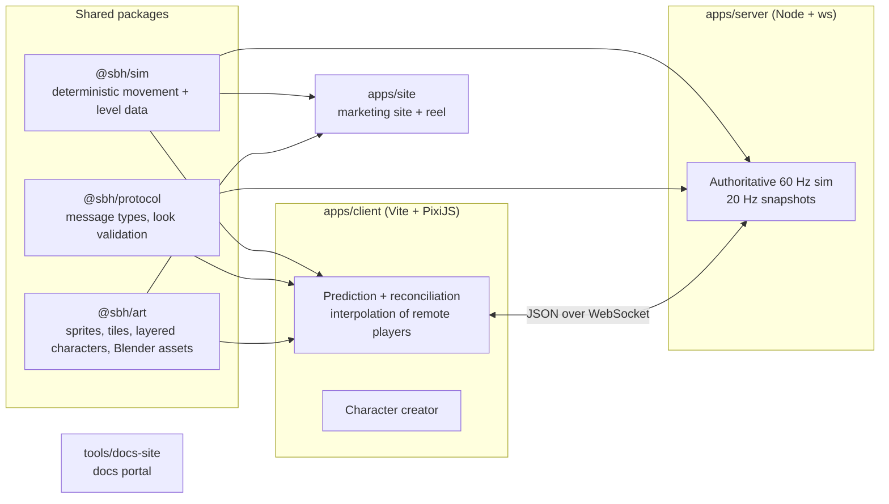

<div align="center">



# Super BoundHaven (SBH)

**A 16-bit platforming MMO with precise movement, original mounts, and co-op that actually needs co-op.**

Early prototype. Not a finished game. Everything below says plainly what exists and what is only planned.

**Created by Anthony ([baconspaceman](https://github.com/baconspaceman)). Human-directed, AI-assisted: built with Claude (Anthropic), OpenAI Codex and Grok (xAI).** [How it's made](docs/AI_DISCLOSURE.md)

 

[Game site](https://baconspaceman.github.io/super-boundhaven/) ·
[Docs portal](https://baconspaceman.github.io/super-boundhaven/docs/) ·
[Prototype (creator works offline)](https://baconspaceman.github.io/super-boundhaven/play/) ·
[Feedback](https://github.com/baconspaceman/super-boundhaven/issues)

`status: pre-alpha prototype` · `license: MIT (code) + CC BY-NC-SA 4.0 (art, content, docs)` · `stack: TypeScript, PixiJS, Node, WebSocket` · `art: original, procedural + hand-authored`

</div>

---

## What is SBH?

Super BoundHaven is an independent, long-term passion project: a side-scrolling 16-bit platformer set in a shared online open world. The goals are tight, learnable movement with a real skill gap; a friendly, chunky, readable look; many original rideable creatures; Metroidvania-style exploration with secrets; and cooperative challenges that require players to coordinate (bounces, switches, timing).

"Super BoundHaven" is a working title. It is unrelated to any other project of the owner's and is not affiliated with any publisher.

## Where things stand

| Area | Status | Notes |
|---|---|---|
| Shared movement simulation | **Prototype, working** | Deterministic, identical on client and server. Slopes, bounce pads, stomp and player-push physics. Unit tested. |
| Authoritative multiplayer server | **Prototype, working** | Node + `ws`, 60 Hz sim, 20 Hz snapshots. Players collide (stomp, bounce, push). |
| Client netcode | **Prototype, working** | Prediction, reconciliation, interpolation; lag/loss simulation flags for testing. |
| Character creator | **Prototype, working** | Layered humanoid paper-doll, live animated preview, random looks, shareable look codes, synced to other players. |
| Regions and backgrounds | **Prototype** | Three art regions (meadow, meadow sunset, caverns) plus Blender-built dawn/day/sunset/night backdrops. |
| Marketing site | **Working** | Gameplay reel replays the real simulation. |
| Mounts (frog, dinosaur, flying drake, cheetah) | **Art only** | Sprite sheets exist. Mount gameplay is **Planned**, not built. |
| Skill tree, abilities, powerups | **Planned** | Full design proposals in the GDD; none implemented. |
| Gear, economy, trading | **Planned** | Design only. |
| Co-op dungeons and raids | **Planned** | Design only. Exact sizes are an open question. |
| Player-made levels, weekly featured level, events | **Planned** | Design only. |
| Accounts, persistence, Steam build | **Planned** | Not started. |
| Hosted online server | **Not available** | The public Pages build has no game server. Run it locally. |

No dates, prices, rewards or monetization terms have been decided or promised.

## Screenshots

| | |
|---|---|
|  |  |
| Day, Blender-built backdrop | Sunset |
|  |  |
| Night | Caverns region |
|  |  |
| Layered character creator | Two players in the shared playground |

More art (sprite sheets, mounts, tilesets, previews) is in the [Art gallery](https://baconspaceman.github.io/super-boundhaven/docs/art.html).

## Planned feature set (design intent)

Everything here is described in detail in the [Game Design Document](docs/design/GAME_DESIGN_DOCUMENT.md), which tags each item **[CONFIRMED]** (the owner's words), **[PROPOSAL]** (awaiting approval) or **[OPEN]** (undecided).

- **Precise movement**: run, jump, skid, stomp, bounce; ability layers that stack without breaking the base feel. *(base movement: Prototype; layers: Planned)*
- **Skill tree and powerups**: an ability system with a "Movement Budget" so builds stay fair. *(Planned)*
- **Original mounts**: frog, dinosaur, flying dinosaur, cheetah first; summonable in the open world; some areas require a specific mount. *(art: Prototype; gameplay: Planned)*
- **Metroidvania exploration**: gated regions, secrets, hidden Easter eggs. *(Planned)*
- **Co-op dungeons and raids**: challenges that need coordinated actions, up to very hard raids for larger groups. *(Planned)*
- **Community levels**: uploads, weekly featured selection, race and time-attack events. *(Planned)*
- **Gear and trading**: functional gear and builds, tradeable items, no real-money gambling. *(Planned)*
- **Browser first, Steam later**, with cross-play intended. *(Planned)*

## Run it locally

Requires **Node.js 24** (what CI uses) and npm. No other runtime services.

```bash
git clone https://github.com/baconspaceman/super-boundhaven.git
cd super-boundhaven
npm install
```

```bash
npm run dev            # server on :8080 + game client on :5173
npm run dev -w @sbh/site   # marketing site on :5174 (separate terminal)
```

Open `http://localhost:5173`, make a character, and join. Open a second browser tab to see two players interact.

Useful client query flags: `?region=meadow|meadow_sunset|caverns`, `?tod=dawn|day|sunset|night`, `?lag=120&loss=5` (simulate latency and packet loss), `?server=ws://host:port`. In game: `A/D` or arrows move, `Space`/`W`/`Z` jump, `Shift`/`X` run, `C` opens the creator, `[` `]` cycle regions, `,` `.` cycle time of day.

```bash
npm test               # vitest: sim, protocol, server, art, client motion tests
npm run typecheck      # tsc --noEmit
```

### Build the art

```bash
npm run build:art -w @sbh/art        # hand-authored pixel art (characters, tilesets, backgrounds) to packages/art/assets
npm run build:blender -w @sbh/art    # procedural Blender time-of-day scenes (needs Blender, see below)
```

The Blender pipeline needs Blender 5.1 (headless, EEVEE) and Python 3.11 with Pillow and numpy; see [Blender pipeline](docs/ART_BLENDER_PIPELINE.md) for flags and the scene-by-scene dev loop. Rendered PNGs are committed, so you only need Blender to regenerate them.

### Build the public site and docs (GitHub Pages layout)

```bash
npm run build:pages    # site + /play/ client + /docs/ portal into apps/site/dist (base /super-boundhaven/)
npm run serve:pages    # serve it locally at http://localhost:4173/super-boundhaven/
npm run linkcheck      # verify every link and image in the built output
npm run audit          # pre-publish safety audit (secrets, emails, large files, local paths)
```

## Architecture



The same movement code runs in the client (for zero-lag prediction), the server (for authority and cheat resistance) and the website (the gameplay reel replays real sim output). Details: [Netcode](docs/NETCODE.md).

## Repo map

| Path | What it is |
|---|---|
| `packages/sim` | Deterministic movement simulation and level definitions |
| `packages/protocol` | Wire protocol types and look-code validation |
| `packages/art` | Pixel-art generators, sprite sheets, tilesets, Blender outputs and manifests |
| `apps/server` | Authoritative WebSocket game server (waitlist endpoint included; its data is git-ignored) |
| `apps/client` | PixiJS game client, character creator, HUD |
| `apps/site` | Marketing site (Vite, no framework) |
| `tools/blender` | Headless Blender scripts for procedural scenes and sprite props |
| `tools/blender-character` | Blender-to-2D character experiments |
| `tools/docs-site` | Docs portal builder, Pages orchestrator, local server, link checker |
| `tools/audit` | Pre-publish repository audit |
| `docs/` | Design, art, netcode and research documents |
| `.github/` | CI, Pages deploy workflow, issue templates |

## Tech stack

TypeScript everywhere. Vite + PixiJS 8 (client), Node + `ws` (server), Vitest (tests), plain CSS (site). Art: pure-TypeScript pixel generators plus headless Blender 5.1 (procedural scenes) with Python/Pillow post-processing. Docs portal: Node + `marked`. No external fonts, trackers or analytics; the sites make no third-party requests.

## Documentation

Browse everything in the **[docs portal](https://baconspaceman.github.io/super-boundhaven/docs/)**, or read the files directly:

| Topic | Document |
|---|---|
| Docs index (what to read first) | [docs/README.md](docs/README.md), [docs/PUBLIC_DOCS_INDEX.md](docs/PUBLIC_DOCS_INDEX.md) |
| Game Design Document (master) | [docs/design/GAME_DESIGN_DOCUMENT.md](docs/design/GAME_DESIGN_DOCUMENT.md) |
| Skill tree and abilities | [docs/design/SKILL_TREE_AND_ABILITIES.md](docs/design/SKILL_TREE_AND_ABILITIES.md) |
| Mounts and exploration | [docs/design/MOUNTS_AND_EXPLORATION.md](docs/design/MOUNTS_AND_EXPLORATION.md) |
| Design brief | [DESIGN_BRIEF.md](DESIGN_BRIEF.md) |
| Art north star | [docs/ART_NORTH_STAR.md](docs/ART_NORTH_STAR.md) |
| Art direction | [docs/ART_DIRECTION.md](docs/ART_DIRECTION.md) |
| World art | [docs/ART_WORLD.md](docs/ART_WORLD.md) |
| Character creator | [docs/CHARACTER_CREATOR.md](docs/CHARACTER_CREATOR.md) |
| Blender pipeline | [docs/ART_BLENDER_PIPELINE.md](docs/ART_BLENDER_PIPELINE.md) |
| Netcode | [docs/NETCODE.md](docs/NETCODE.md) |
| Research: Blender to 2D characters | [docs/research/CHARACTER_BLENDER_TO_2D.md](docs/research/CHARACTER_BLENDER_TO_2D.md) |
| Research source notes | [docs/research/sources/notes.md](docs/research/sources/notes.md) |
| Accepted decisions log | [DECISIONS.md](DECISIONS.md) |
| Open questions | [OPEN_QUESTIONS.md](OPEN_QUESTIONS.md) |
| Roadmap / next actions | [docs/NEXT_ACTION.md](docs/NEXT_ACTION.md) |
| First milestone spec | [docs/superpowers/specs/2026-09-30-sbh-m1-shared-playground-design.md](docs/superpowers/specs/2026-09-30-sbh-m1-shared-playground-design.md) |

## How this project is built

SBH is **human-directed and AI-assisted** (full statement: [docs/AI_DISCLOSURE.md](docs/AI_DISCLOSURE.md)). The owner, Anthony (GitHub: `baconspaceman`), sets the vision, makes every design decision and accepts or rejects every proposal. The AI tools used are Claude (Anthropic), OpenAI Codex and Grok (xAI), with Claude doing most of the day-to-day engineering. Day-to-day engineering is done with **Claude (Anthropic) acting as head of development**, delegating to teams of sub-agents that each own a disjoint set of files (movement sim, netcode, art, Blender pipeline, design docs, site). Work is verified by tests, type-checking and real browser checks, and proposals stay labelled as proposals until the owner accepts them (see [DECISIONS.md](DECISIONS.md)). The handoff notes that let sessions resume are public in [docs/NEXT_ACTION.md](docs/NEXT_ACTION.md).

## Originality and assets

- **All code, art, designs, names and documents in this repository are original work** made for this project.
- Super Mario World (and similar classic platformers) are named **only as inspiration and craft references** for feel and visual clarity (bold shapes, readable silhouettes, tight movement). SBH's characters, creatures, tiles, levels and mechanics are original designs.
- **No Nintendo or other third-party assets, ROMs, ISOs, sprites, music, sound, or code** are included or used. No ROM or emulator files are in the repository, and the audit tool checks for them.
- **Blender scenes are procedural**: generated by scripts in `tools/blender` from primitives, palettes and fixed seeds, then pixelized. No downloaded models or textures.
- Pixel art is produced by code in `packages/art` or by the Blender pipeline above.
- Dependencies are standard open-source npm packages under their own licenses (see `package-lock.json`).

See [NOTICE.md](NOTICE.md) for trademark notes and [PLACEMENT_AND_PROVENANCE.md](PLACEMENT_AND_PROVENANCE.md) for the project's provenance record.

## Contributing and feedback

Code contributions are **not being accepted yet**. Feedback, bug reports and ideas via [GitHub Issues](https://github.com/baconspaceman/super-boundhaven/issues) are welcome. Details in [CONTRIBUTING.md](CONTRIBUTING.md). The site collects no analytics; the issue templates ask for no personal data.

## License

Open source. **Code is MIT** (see [`LICENSE`](LICENSE)). **Art, characters, designs, lore and documentation are CC BY-NC-SA 4.0** (see [`LICENSE-ASSETS.md`](LICENSE-ASSETS.md) for exactly which files, and [`LICENSE-ASSETS.txt`](LICENSE-ASSETS.txt) for the full legal text): free to share and adapt with attribution, not for commercial use, adaptations share alike. The name and logo "Super BoundHaven" are not licensed for derivative products.
