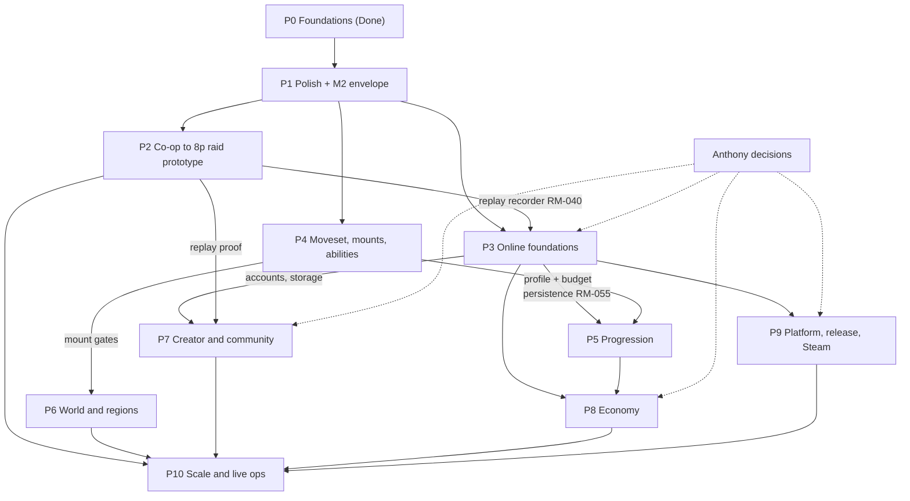

<!-- core:start -->
**Super BoundHaven master roadmap.** An open-ended, phased plan for finishing and growing SBH, written for a team of AIs under Anthony (owner and final authority; only he may spend money, create accounts, post publicly or sign anything). Roles: Claude is lead for game design, architecture, art direction and integration; Codex is second lead for engineering, infrastructure, CI, hosting/deploy, persistence, security, performance and code review; Grokbot is second lead for operations, automation, bots, community, analytics, content/research pipelines and load/playtest bot swarms; Kimi assists via the shared mailbox. There are no calendar dates, prices, reward amounts or launch promises anywhere in this roadmap: only phase order, dependencies, entry/exit criteria and relative sizes (S/M/L/XL).
Current truth (verified 2026-10-04, commit `cff9c4c`): 241 tests in 17 files pass. Working prototypes: shared sim, authoritative server (protocol v3), prediction client, creator, three art regions, gamepad support, M3 rules layer with the 2-4 player Twin Plates co-op room. Art-only: four mounts. Planned: everything else (accounts, persistence, hosting, mounts gameplay, abilities, skill tree, gear, editor, economy, events, more regions, Steam). Phases: P0 Foundations (Done), P1 Polish and small region, P2 Co-op to 8-player raid, P3 Online foundations, P4 Moveset/mounts/abilities, P5 Progression, P6 World and regions, P7 Creator and community, P8 Economy, P9 Platform and release, P10 Scale and live ops. About 125 items carry stable IDs `RM-001..` with status Done / In progress / Next / Later / Blocked. Start at [roadmap/BOARD.md](roadmap/BOARD.md); owner-only items are in [roadmap/DECISIONS_NEEDED.md](roadmap/DECISIONS_NEEDED.md); who does what is in [ai-team/WORKSTREAMS.md](ai-team/WORKSTREAMS.md).
<!-- core:end -->

# Super BoundHaven master roadmap

Related: [NEXT_ACTION](NEXT_ACTION.md) (session handoff), [GDD](design/GAME_DESIGN_DOCUMENT.md) (section 12 is the earlier M1..M14 outline this roadmap supersedes in detail), [DECISIONS](../DECISIONS.md), [OPEN_QUESTIONS](../OPEN_QUESTIONS.md), [NETCODE](NETCODE.md). Other agents maintain the game bible, mechanics specs, AI-team charter/protocol/prompts and maintenance guides under `docs/bible/`, `docs/mechanics/`, `docs/ai-team/` and `docs/maintenance/` (this roadmap links to those directories but does not write them). A private revenue roadmap exists, held by Anthony and the lead; it is not part of this repository.

## 1. How to read this

- **Status:** Done (shipped and tested), In progress (agent currently on it), Next (ready now, see BOARD), Later (needs a dependency), Blocked (needs an Anthony decision, spend or account).
- **Owner roles:** Claude, Codex, Grokbot, Kimi (support), Anthony. Full RACI: [ai-team/WORKSTREAMS.md](ai-team/WORKSTREAMS.md).
- **Sizes:** S = a focused session; M = a few sessions; L = a multi-session feature with its own design note; XL = a program of work split into several L items. No time conversion is implied.
- **Labelling rule:** anything not confirmed by Anthony stays labelled proposal; design status words follow GDD tags [CONFIRMED], [ACCEPTED-DELEGATED], [PROPOSAL], [OPEN].
- Phase detail, entry/exit criteria and per-item acceptance criteria are in `docs/roadmap/P*.md`.

## 2. Current state (verified from code and tests)

Verified by running `npx vitest run` (17 files, 241 tests, all pass) and reading the source on 2026-10-04. Typecheck was not re-run for this document (labelled unverified here; NEXT_ACTION records it passing).

| Area | State | Evidence |
|---|---|---|
| Movement sim | Implemented, deterministic, shared by client/server/site reel | `packages/sim/src/{player,step,entities,level,config}.ts` |
| M3 rules layer | Implemented: crouch/action (six-bit mask `BTN_MASK`), one-way platforms, spikes, checkpoints, shards, enemies, levers, plates, doors | `packages/sim/test/{m3,coop}.test.ts`, `docs/design/COOP_ROOM_M3.md` |
| Co-op room | "Twin Plates" 190 x 16 tiles, 2-4 players, solvability proven by scripted bots at sim level (not over WebSocket) | `packages/sim/src/levels/coopRoom.ts` |
| Server | Single level per process (`SBH_LEVEL`), 16-player cap (room cap overrides, 4 for coopRoom), 60 Hz / 20 Hz, 1 KB frame cap, `/healthz`, waitlist POST with origin allowlist and rate limit | `apps/server/src/{server,waitlist,index}.ts` |
| Protocol | v3, JSON over WebSocket; messages: join, setLook, input, ping / welcome, snap, look, pong, error | `packages/protocol/src/index.ts` |
| Client | PixiJS; prediction/reconciliation/interpolation; creator; gamepad and remap UI; HUD and prompts; region and time-of-day switchers; `?lag=&loss=` | `apps/client/src/*` |
| Art | Hand-authored layered humanoid, enemies, effects, four mount sheets, gameplay object art, three regions plus four Blender time-of-day backdrops | `packages/art`, `docs/ART_*.md` |
| Site and docs | Marketing site with sim-replay reel, docs portal, Pages deploy on push to main (tests run first) | `.github/workflows/{ci,pages}.yml` |
| Not present | Accounts, persistence, hosted server, mount gameplay, powerups, skill tree, gear, economy, editor, audio, chat of any kind, metrics endpoint, telemetry, bots, Steam build | grep of repo; README status table agrees |

### Known issues (from `docs/NEXT_ACTION.md`, re-checked against code where noted)

No hero crouch frame (uses land squash); lever art low contrast; idle flag too grey; ACTION prompt overlaps name tag; enemy hitbox 14 px vs bigger sprite; spikes too white; open-gate frame abstract; stomp kills not predicted (about 50 ms hitch); one-off Windows vitest worker crash (exit 3221226505), not reproduced in 4 reruns. Additional gaps found while verifying: server hosts one level per process (blocks multi-room play); no connection or input rate limit beyond look-change tokens and the 1 KB frame cap (unverified exhaustively); co-op solvability was proven in the sim only, never over a real socket with latency.

### Where existing docs contradict the code

1. `README.md` status table lists co-op dungeons as Planned and omits the M3 rules layer, Twin Plates room and gamepad support, all of which exist.
2. `apps/site/index.html` roadmap chips mark M3 "Co-op challenge" as Planned although the Twin Plates room is implemented (still prototype-grade, so the chip should read "Prototype").
3. `DESIGN_BRIEF.md` line 65 says "No implementation located"; there is a working implementation.
4. `docs/NEXT_ACTION.md` header says Updated 2026-09-30 but contains 2026-10-01 content; it still says the licence is "none chosen, so all rights reserved" (line 28) although MIT + CC BY-NC-SA was applied; "In flight" lists are stale.
5. GDD 12.2 was synced with the code on 2026-10-04: M3 and M4's core (six inputs, crouch, action, checkpoints, enemies, co-op room) are marked shipped; per-player movement config threading remains.
6. `README.md` run section lists keyboard keys only; crouch/action and gamepad are in `docs/CONTROLS.md`.

These are folded into RM-019.

## 3. Phase overview

| Phase | Name | Status | Size | Lead(s) | Detail |
|---|---|---|---|---|---|
| P0 | Foundations | Done | n/a | Claude, Codex | [P0](roadmap/P0-foundations.md) |
| P1 | Polish, M1 sign-off, small shared region (M2) | In progress | M | Claude | [P1](roadmap/P1-polish-m1-m2.md) |
| P2 | Co-op rooms to 8-player raid prototype | Next | XL | Claude, Codex, Grokbot | [P2](roadmap/P2-coop-raids.md) |
| P3 | Online foundations: hosting research, security, persistence, accounts | Next | XL | Codex | [P3](roadmap/P3-online-foundations.md) |
| P4 | Moveset, mounts, abilities | Later | XL | Claude | [P4](roadmap/P4-moveset-mounts-abilities.md) |
| P5 | Progression: mastery, skill tree, gear | Later | XL | Claude | [P5](roadmap/P5-progression.md) |
| P6 | World, regions, Metroidvania, audio, casino lore | Later | XL | Claude | [P6](roadmap/P6-world-regions.md) |
| P7 | Creator tools and community | Later | XL | Claude, Codex, Grokbot | [P7](roadmap/P7-creator-community.md) |
| P8 | Economy and trading | Later | XL | Codex, Claude | [P8](roadmap/P8-economy.md) |
| P9 | Platform, accessibility, release, Steam | Later (CI/docs items Next) | XL | Codex | [P9](roadmap/P9-platform-release.md) |
| P10 | Scale, full MMO, live ops | Later | XL | Codex, Grokbot | [P10](roadmap/P10-scale-live.md) |

Phases overlap by design: P1 and the "Next" slices of P2/P3/P9 run in parallel because they touch disjoint files (art/client vs server/infra vs bots/docs).

## 4. Item index (stable IDs)

Statuses: Done, In progress, Next, Later, Blocked. Acceptance criteria live in each phase file. IDs are never reused; gaps are reserved.

**P0 (Done):** RM-001 sim; RM-002 server and protocol; RM-003 client netcode; RM-004 creator; RM-005 art pipeline; RM-006 site/docs/CI/Pages; RM-007 licensing and audit; RM-008 gamepad (real-pad test pending); RM-009 M3 layer and Twin Plates.

**P1:** RM-010 crouch frame (Next, Claude, S); RM-011 legibility pass (Next, Claude, S); RM-012 prompt overlap (Next, Claude, S); RM-013 enemy hitbox (Next, Claude, S); RM-014 predict stomp kills (Next, Codex, M); RM-015 front-facing face (Next, Claude, M); RM-016 real-pad test (Next, Anthony, S); RM-017 M2 envelope (Next, Codex+Grokbot, M); RM-018 vitest crash triage (Next, Codex, S); RM-019 truth sync (Next, Claude, S); RM-020 feel tuning doc (Next, Claude, S); RM-021 first authored region level (Later, Claude, M).

**P2:** RM-030 Twin Plates bot solvers (Next, Grokbot, M); RM-031 sync-window fairness (Next, Codex+Grokbot, M); RM-032 second co-op room (Later, Claude, M); RM-033 multi-room server (Later, Codex, L); RM-034 8-player dropout rules (Later, Claude+Codex, M); RM-035 raid room format (Later, Claude, L); RM-036 8-player raid prototype (Later, Claude, L); RM-037 8-bot stress run (Later, Grokbot, M); RM-038 first puzzle boss (Later, Claude, L); RM-039 party/join-by-code (Later, Codex, M); RM-040 replay recorder (Later, Codex, L).

**P3:** RM-050 hosting research (Next, Codex, M); RM-051 Dockerfile and /metrics (Next, Codex, M); RM-052 bot client library (Next, Grokbot, M); RM-053 production config (Later, Codex, M); RM-054 staging pipeline (Blocked, Codex, M); RM-055 persistence layer (Later, Codex, L); RM-056 guest/accounts (Blocked, Codex, L); RM-057 quick-chat only (Later, Claude+Codex, M); RM-058 authority hardening (Next, Codex, M); RM-059 anti-cheat replay re-sim (Later, Codex, L); RM-060 security hygiene (Next, Codex, S); RM-061 observability (Later, Grokbot+Codex, M); RM-062 backup/restore (Later, Codex, M); RM-063 waitlist data review (Next, Codex, S); RM-064 protocol versioning and binary evaluation (Later, Codex+Claude, M); RM-065 channels/instances architecture (Later, Codex, XL); RM-066 telemetry (Later, Grokbot+Codex, L).

**P4:** RM-070 MovementProfile (Next, Claude+Codex, M); RM-071 frog mount prototype (Later, Claude, L); RM-072 mount framework (Later, Claude, L); RM-073 remaining mounts (Later, Claude, XL); RM-074 mount questlines (Later, Claude, L); RM-075 powerups (Later, Claude, L); RM-076 Movement Budget and rulesets (Later, Claude+Codex, L); RM-077 level object layer (Later, Claude, L); RM-078 Classic leaderboard (Later, Codex, M); RM-079 mounted rider art (Later, Claude, M).

**P5:** RM-080 mastery (Later, L); RM-081 skill tree (Later, L); RM-082 free respec/presets (Later, M); RM-083 gear system (Later, L); RM-084 loadouts persisted (Later, M); RM-085 equipment art (Later, L); RM-086 balance tooling (Later, Grokbot, M); RM-087 progression tuning (Later, M). Owners per phase file.

**P6:** RM-090 zone graph/map; RM-091 content slice (Grassland, Caves, Factory); RM-092 Factory; RM-093 Jungle; RM-094 Underwater/pirate; RM-095 Sky; RM-096 Lava; RM-097 Storm; RM-098 Haunted; RM-099 Space; RM-100 Bayou; RM-101 Candy; RM-102 Desert; RM-103 City hub; RM-104 secrets/Easter eggs; RM-105 mirror and pursuing-threat variants; RM-106 audio runtime and SFX; RM-107 original music; RM-108 enemy/boss roster; RM-109 cat construction site to casino (Blocked: mechanics). All Later, Claude lead.

**P7:** RM-110 Level schema and validator (Next); RM-111 editor v1 (Later); RM-112 replay proof (Later); RM-113 upload API (Blocked); RM-114 moderation tooling (Blocked: policy); RM-115 weekly featured (Later); RM-116 events (Later); RM-117 quick-chat UI (Later); RM-118 social (Later); RM-119 community goals page (Blocked: content); RM-120 community/ops bot (Next, Grokbot); RM-121 changelog generator (Later, Grokbot).

**P8:** RM-130 currency model placeholders; RM-131 ledger; RM-132 atomic trade; RM-133 crafting/sinks; RM-134 market; RM-135 dupe detection; RM-136 casino tokens (Blocked); RM-137 monetization surface (Blocked).

**P9:** RM-140 accessibility; RM-141 localization; RM-142 Steam build (account Blocked); RM-143 cross-play; RM-144 release engineering; RM-145 performance budget; RM-146 docs/dev experience (Next); RM-147 CI hardening (Next); RM-148 legal clearance (Blocked); RM-149 touch (parked); RM-150 provenance audit upkeep (Next).

**P10:** RM-160 load tests; RM-161 sharding; RM-162 cross-region; RM-163 live-ops tooling; RM-164 shared overworld; RM-165 raid tier content; RM-166 incident runbooks; RM-167 privacy workflows (Blocked).

Coverage check against the brief: M1/M2 polish (P1); M3 to raid (P2); accounts/persistence/guest linking (RM-055/056); hosting (RM-050..054); anti-cheat/authority (RM-058/059); mounts (RM-071..074, 079); abilities (RM-075/076); skill tree/mastery/respec (RM-080..082); gear/budget/rulesets (RM-076, 083..085); editor/validation/moderation/featured (RM-110..115); economy/trading (P8); social/chat safety (RM-057, 117, 118); events (RM-116); regions (RM-091..103); casino (RM-109/136); Metroidvania (RM-090, 104); audio (RM-106/107); accessibility/localization (RM-140/141); Steam and cross-play (RM-142/143); community goals (RM-119); telemetry (RM-066); moderation (RM-114); docs/dev experience (RM-146); performance and bot swarms (RM-017, 037, 160); release engineering (RM-144).

## 5. Cross-cutting gates (apply to every phase)

- Tests: `npx vitest run` and `npx tsc --noEmit -p tsconfig.json` pass; visual changes get a real browser check.
- Determinism: any sim change must keep client/server/site-reel identical (no random or time sources in `packages/sim`).
- Originality: no third-party assets, ROMs, music or code; provenance logged.
- Safety: no real-money gambling; no loot boxes; no free-text chat until Anthony decides; no PII in telemetry; nothing under `apps/server/data/` ever committed.
- Promises: no dates, prices, rewards, raid sizes beyond the decided cap of 8, or monetization terms in any public doc.
- Public side effects (posting, accounts, spend, signing): Anthony only.

## 6. Top 10 next items

1. RM-019 truth sync (README, site chips, brief, handoff).
2. RM-010..013 the four small legibility/art/hitbox fixes.
3. RM-052 bot client library, then RM-030 Twin Plates bot solvers over a real socket.
4. RM-058 authority hardening and RM-051 metrics/Dockerfile.
5. RM-017 and RM-031 latency envelope and sync-window fairness.
6. RM-050 hosting options research (doc only, no spend).
7. RM-014 predicted stomp kills.
8. RM-015 front-facing creator face and RM-016 Anthony's controller test.
9. RM-070 MovementProfile plumbing (unblocks mounts, rulesets, regions).
10. RM-110 Level schema v1 plus validator (unblocks editor and replay proof).
