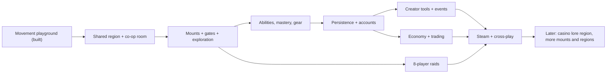
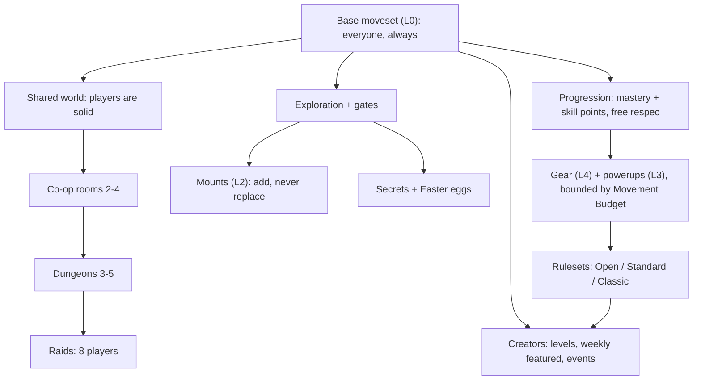

<!-- core:start -->
# Super BoundHaven Design Bible: master overview

**What it is.** Super BoundHaven (SBH) is an independent, long-term passion project: a polished 16-bit side-scrolling platforming MMO. Movement is the skill (momentum, run-jumps, slopes, bounce pads, stomp-bounces). The open world is shared and players are solid: you stomp, bounce and push each other. Co-op must genuinely require coordination (bounces, switches, timing), up to eight-player raids; smaller co-op rooms are for two to four. Original rideable mounts (frog, dinosaur, flying dinosaur, cheetah first; no wolf), Metroidvania exploration with secrets and Easter eggs, functional gear that eases but never replaces skill, community-made levels with weekly featured picks and events. Browser first, Steam later, cross-play intended.

**Pillars.** P1 movement is the skill; P2 fair, forgiving, endlessly retryable; P3 together is the point; P4 explore and discover; P5 gear eases, never replaces; P6 made by everyone; P7 original, cheerful, readable (Super Mario World essence, 100 percent original designs, no cubes); P8 challenging but not too difficult, and mounts must be easy to get.

**Hard rules.** Originals only, no third-party assets or mocap. Name stays "Super BoundHaven" (keep "Super"); no Bacon or Spaceman branding. No paid power. No real-money gambling. Base moveset must make required content possible. No dates, prices, reward amounts or launch promises, ever, without Anthony. Long-term and open-ended: no feature too big, no addition too small, so design for extensibility and phase everything.

**Tone.** Cheerful, bold, welcoming, never smug; honest about what exists.

**Status.** Pre-alpha prototype: deterministic shared simulation, authoritative server with prediction, layered character creator, three art regions with dawn/day/sunset/night backdrops, keyboard and gamepad support, and a co-op "Twin Plates" room. Mounts have art only. Powerups, skill tree, gear, economy, raids, editor, accounts, audio and hosted servers are not built.

**Who decides.** Anthony owns every design decision. The lead (Claude) maintains canon; second leads (Codex, Grokbot) propose.
<!-- core:end -->

# 1. Vision

SBH is for people who love the feel of precise 16-bit platforming and want to share it. The player fantasy: *"I got better at moving, I found a secret nobody told me about, and my friends and I did something together that none of us could do alone."* The game should be simple to start (walk, jump, bounce), deep to master, and warm to live in.

SBH is **human-led**. Anthony sets the vision and accepts or rejects every proposal; AI leads do the engineering and documentation under written rules (`../ai-team/`). Proposals stay labelled as proposals until Anthony accepts them.

## 1.1 One-paragraph pitch

Super BoundHaven is a 16-bit side-scrolling platforming MMO where movement is the skill and the world is shared. Run, jump and bounce through bright, chunky regions with other players who are physically there: you can stomp-bounce off a friend to reach what no solo jump can. Summon original rideable animals, hunt for secrets, build your own levels, and team up for co-op challenges and eight-player raids designed so nobody can carry everyone else. It is challenging but fair, welcoming to newcomers, and made entirely from original art and code.

## 1.2 One-page pitch

**Title:** Super BoundHaven (working title; "Super" is kept by Anthony's choice).
**Genre:** Platforming MMO, side-scrolling, 16-bit style.
**Platform:** Browser first; Steam later; browser and Steam players intended to share a world.
**Hook:** *Bounce together. Master every jump.* (current public tagline)

1. **Move.** Tight momentum movement with a real skill gap: walk and run, variable-height jumps, skids, slopes, bounce pads, stomps. Six inputs: left, right, jump, run, crouch, action.
2. **Share.** A real-time shared world. Players are solid. The stomp-bounce is the co-op primitive: standing on a friend's head and being launched is a mechanic, not a bug.
3. **Cooperate.** Rooms and raids that require several players to execute together: simultaneous plates, timed levers, stacked bounces. Rooms for two to four; the hardest raids need eight. Puzzle bosses, not three-hit patterns.
4. **Ride.** Original mounts that add abilities to the base moveset and never replace it. Some places need a particular mount. Mounts are friendly to earn, free and permanent.
5. **Explore.** A Metroidvania-style open world of fourteen imagined regions, gated by mounts, abilities, switches and knowledge, with secrets and Easter eggs.
6. **Build.** A layered humanoid character creator (stout, expressive, original) and, later, a level editor with weekly featured levels and community races.
7. **Grow.** A skill-point tree and mastery-by-use unlocks with free respecs; functional gear bounded by a Movement Budget so builds are fun and the skill ceiling stays intact.

**Look:** the bold, chunky, cheerful essence of classic 16-bit platformers, made fully original: dark hue-matched outlines, flat two-to-three tone shading, 16x16 tiles, 256x224 native with integer scaling.

**Honest status:** a rough, playable prototype. We say plainly what exists and what is only planned.

## 1.3 Audience

| Audience | Why SBH is for them |
|---|---|
| Precision-platformer fans | Real skill gap; learnable movement; optional Kaizo-style hard content |
| Social and MMO players | Shared world, parties, trading, creator community (feel references: MapleStory, PokeMMO, Club Penguin, WoW; for community feel only) |
| Friends who want to do something together | Co-op that actually needs co-op |
| Creators | Character creator now; level editor later |
| Newcomers to hard games | Friendly onboarding, instant retry, optional assists, easy mounts |
| Contributors and tinkerers | Open source (MIT code, CC BY-NC-SA art and docs), deterministic sim, public docs |

Age band and chat posture are **[OPEN]**, needing Anthony; interim development default is quick-chat only, no free text (see `UX_AND_ACCESSIBILITY.md`).

## 1.4 Pitches for different audiences

**Player (short).** "Run, jump, bounce off your friends, ride a frog, find the secret. A 16-bit platformer MMO where your movement skill is the real power and nobody can carry you through the hard stuff."

**Player (store-style, once something is sellable; no prices implied).** "Master precise 16-bit movement, summon original mounts, uncover secrets across a shared world, and team up for co-op challenges built so every player matters."

**Press.** "Super BoundHaven is an open-source, human-led indie MMO platformer built around one idea: movement is the skill, and cooperation is a mechanic. Players are physically solid, so a stomp-bounce off a teammate's head opens routes no solo jump can. It is early: a deterministic shared simulation with client prediction and a layered character creator are playable today. Art, code and docs are original and published under open licenses; mounts, raids and community levels are planned and clearly marked as such."

**Investor-neutral (no revenue claims).** "An independent, open-source, browser-first platforming MMO with a distinctive co-op mechanic (physical player collision with authoritative netcode), a working deterministic simulation shared by client, server and website, and a documented, phased roadmap. Scope is deliberately long-term and extensible. Business model, pricing and funding are undecided and intentionally not part of this document."

**Contributor.** "Everything is TypeScript. One deterministic simulation runs in the browser, on the server and on the marketing site. Art is generated from code plus a procedural Blender pipeline. Read the Design Bible, check the canon register, pick a task from the roadmap, and keep everything original. Proposals are welcome; canon changes go through the lead and Anthony."

**AI collaborator.** "Read `docs/bible/README.md` and the 'Never contradict these' list in `CANON_REGISTER.md` first. Tag every claim CONFIRMED, ACCEPTED-DELEGATED, PROPOSAL or OPEN. Never invent decisions. Never promise dates, prices or rewards. Verify before claiming done."

## 1.5 Pillars in detail

| # | Pillar | Tag | What it means | What it forbids |
|---|---|---|---|---|
| P1 | Movement is the skill | CONFIRMED | Deep base moveset; challenge mostly from precision and timing | Stat checks that replace execution |
| P2 | Fair, forgiving, endlessly retryable | CONFIRMED (principle); mechanics ACCEPTED-DELEGATED | Instant retry, checkpoints, readable failure | Lives, punitive loss, invisible requirements |
| P3 | Together is the point | CONFIRMED | Solid players; coordination required; no solo carries | Solo-completable "co-op" |
| P4 | Explore and discover | CONFIRMED | Metroidvania gating, secrets, Easter eggs | Hard-locking players; mandatory hunting |
| P5 | Gear eases, never replaces | CONFIRMED | Builds are fun and bounded by the Movement Budget | Pay-to-win; gear that trivializes skill |
| P6 | Made by everyone | CONFIRMED | Level uploads, weekly featured, events | Unvalidated, unmoderated content |
| P7 | Original, cheerful, readable | CONFIRMED | SMW essence, 100 percent original; stout humanoids; no cubes | Copying, grimness, mud, noise |
| P8 | Challenging but not too difficult; mounts approachable | CONFIRMED (Anthony's words) | Hardest content optional; assists exist; mounts easy | Brutal gates on required content or mounts |

## 1.6 What SBH is and is not

| SBH is | SBH is not |
|---|---|
| An independent original platformer MMO | A clone, reskin or fangame of any Nintendo or other title |
| Skill-first, gear-assisted | Pay-to-win |
| Cooperative by design (eight-player raids, two-to-four co-op rooms) | A solo game with a chat window |
| Browser first, Steam later | Bound to any launch date or platform exclusivity |
| Open source (MIT code; CC BY-NC-SA art, content and docs; name and logo reserved) | Free for others to use commercially or to rebrand |
| A cheerful world with quirky humor | Grim, edgy or smug |
| Long-term and open-ended | A fixed feature list with a ship date |
| Honest about status | Hype, fake trailers or invented milestones |
| A game with fictional casino lore (much later) | A gambling product; no real-money gambling, no loot boxes |
| Human-led with AI engineering help | AI-generated slop: AI work is verified and owner-accepted |

## 1.7 Long-term, open-ended ambition

Anthony's standing intent **[CONFIRMED]**: "no feature too big, no addition too small." This does not mean "build everything now"; it means:

1. **Design for extensibility.** Data-driven levels, options, anims and gates; new categories slot into the creator, protocol and server without redesign (`../CHARACTER_CREATOR.md` "Adding options later").
2. **Phase everything.** Each system has a smallest useful slice, a proof, and an exit test before the next one begins. See the milestone ladder in `PROGRESSION_AND_CONTENT.md` and `../ROADMAP.md`.
3. **Welcome small additions.** A new hat, a new hair style, a new secret, a new sound: all are legitimate canon additions if they pass the on-canon checklist in `CHANGE_PROTOCOL.md`.
4. **Welcome big additions with a proposal.** A new region, mount, mode or system starts as a labelled PROPOSAL with fairness, art and netcode notes.
5. **Never trade honesty for scope.** Unbuilt things are labelled Planned or Proposal everywhere.

(Order is priority, not a schedule.)

## 1.8 The design in one diagram

# 2. How to use the bible

* Need a fact? `CANON_REGISTER.md`.
* Need to know whether you may do something? `FAQ.md`, then the checklist in `CHANGE_PROTOCOL.md`.
* Writing text, art, sound or levels? `TONE_AND_VOICE.md`, `CHARACTERS_AND_CREATURES.md`, `AUDIO_DIRECTION.md`, `WORLD_BIBLE.md`.
* Building a system? `SYSTEMS_STATUS.md` for what exists, `../mechanics/` for exact numbers, `PROGRESSION_AND_CONTENT.md` for how it fits the ladder.
* Unsure? Ask Anthony through the lead. Never guess on money, legal, safety or public promises.
