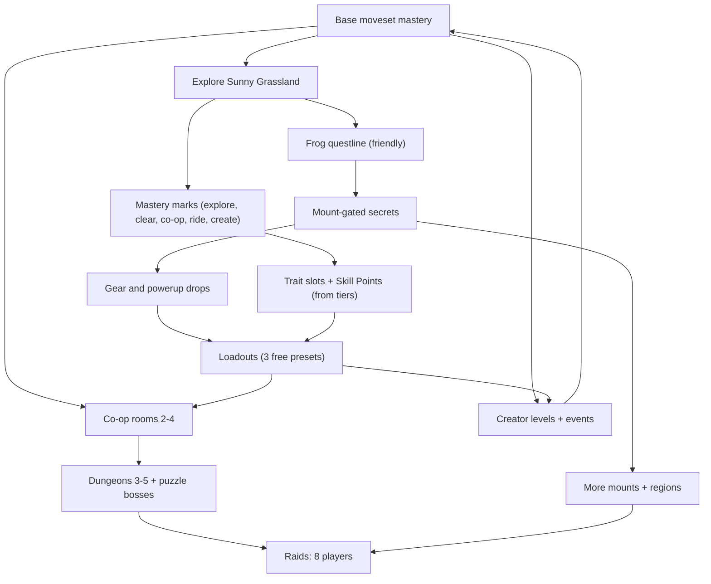

<!-- core:start -->
# Progression and content ladder

Progression is skill-first: every reward widens options, and mastery always feeds back into harder optional content. The ladder runs from the base moveset, to the starter region and its first mount, to co-op rooms (2 to 4 players), dungeons (3 to 5), and finally eight-player raids, with community levels and events alongside. The required path is always clearable by an average player; the hardest content (raids, Kaizo-style trials) is optional endgame.

**Difficulty tiers [ACCEPTED-DELEGATED; philosophy CONFIRMED].** T0 onboarding (at least 95 percent clear in the first session), T1 required path (at least 90 percent within two sessions), T2 mount questlines (at least 90 percent finish within about 45 minutes; no segment above 10 median attempts), T3 optional bonus (50 to 70 percent eventually), T4 hard optional and co-op dungeons (20 to 40 percent of those who try), T5 raids and Kaizo (1 to 10 percent, no floor). These are internal design goals, not public promises.

**Progression systems.** Skill model is both a skill-point tree and mastery-by-use unlocks with free instant respecs and three free presets [CONFIRMED]. Mastery layer first, tree overlay second; Skill Points come only from mastery tiers; everything draws from one Movement Budget. Mounts are earned by short friendly questlines, never sold or in the tree. Gear and powerups ease but never replace skill. Rulesets Open, Standard and Classic keep competitive play fair.

**Failure.** Instant retry, checkpoints, no lives, no punitive loss; raids checkpoint by segment.

**Co-op and raids.** Two-to-four co-op rooms teach primitives (Twin Plates exists today); dungeons mix execution and puzzle bosses; raids need exactly eight with a pause-and-replace disconnect rule.

**Community.** Tile-only level editor first; validation with replay proof; hybrid weekly featured pick; races and time attacks on beloved levels; cosmetic and recognition rewards only, nothing promised.

**Built today.** Base movement, the first hour's mechanics, and Twin Plates. Everything else is planned.
<!-- core:end -->

# 1. Interlock diagram

# 2. The content ladder

| Rung | Content | Group | Tier | Status |
|---|---|---|---|---|
| 0 | Creator, first steps in the shared playground | 1+ | T0 | Built (prototype) |
| 1 | Sunny Grassland required path, first pit and wall | 1+ | T0 to T1 | Partly built (playground level only) |
| 2 | Frog questline | Solo | T2 | Planned (art only) |
| 3 | Crystal Caves, Clockwork Factory required paths | 1+ | T1 | Planned (Caves art exists) |
| 4 | Mount-gated optional secrets, bonus rooms | 1+ | T3 | Planned |
| 5 | Remaining three mount questlines | Solo | T2 | Planned |
| 6 | Co-op rooms | 2 to 4 | T3 to T4 | One built (Twin Plates, 2 to 4) |
| 7 | Co-op dungeons with puzzle bosses | 3 to 5 | T4 | Planned |
| 8 | Standard and Classic race boards, time attacks | Solo or party | T3 to T4 | Planned |
| 9 | Hard trials, Kaizo-style optional | 1+ | T5 | Planned |
| 10 | 8-player raids | 8 | T5 | Planned |
| 11 | Player-made levels, weekly featured, events | Any | Varies | Planned |
| 12 | Late update: cat construction site and casino | Any | T1 to T3 flavor | Planned (lore only) |

# 3. First hour, first day, first month [PROPOSAL]

| Span | Experience | Systems | Built? |
|---|---|---|---|
| **First hour** | Create a look. Join the shared grassland. Learn walk, run, variable jump, bounce pads, stomp-bounce. First 5-tile pit (needs a run-jump) and 4-tile wall. A friend bounces you over the 6-tile wall. Find the frog pond and the first gate. | L0 moves, cosmetics, stomp co-op | Mostly (movement, creator, wall and pit exist in the playground) |
| **First day** | Explore two to three regions, earn one or two mounts, find first secrets, pick up first powerups (Coil Spring, Magnet Mitt), try a co-op trial with friends, earn first mastery perks, make a first loadout. | Mounts, mastery, gear, trials | No |
| **First month** | Tune a build, try Standard race boards, run a dungeon, build and publish a level, join a weekly featured event, possibly attempt an 8-player raid (optional), collect cosmetics. | Gear, trading, editor, events, raids | No |
| **Beyond** | Regional mastery, raid progression, Classic boards, crafting, creator reputation, the cat casino region. | All | No |

Wording note: these spans describe player experience, not schedules or promises.

# 4. Tutorial design [PROPOSAL]

Goals: teach by doing, never by walls of text; the first five minutes are fun even if the player reads nothing.

1. **Onboarding level (T0).** The shared Grassland teaches one idea at a time in space order: walk and run (open ground), variable jump (small steps), run-jump (first pit), bounce pad (arrow-shaped coil), slope, one-way platform and crouch drop-through, stomp a Sproutling, shard collection, checkpoint flag.
2. **Contextual hints.** One at a time, dismissible, repeatable from settings; controller-aware glyphs (`TONE_AND_VOICE.md`).
3. **Co-op primer.** The six-tile wall in the playground is the first "you need a friend" moment; a hint is available if a player is alone ("Some walls need a friend").
4. **Safe failure.** Instant retry, checkpoints before every challenge, no lives.
5. **Optional practice.** Practice mode, ghost and slow motion (assist), available any time.
6. **No gating by tutorial.** Experienced players can skip; nothing required is hidden behind the tutorial.
7. **Measured.** T0 targets: at least 95 percent clear in the first session; median three or fewer attempts per obstacle; revise on playtest data (`../design/DIFFICULTY_PHILOSOPHY.md`).

# 5. Mount questlines [ACCEPTED-DELEGATED design; per-mount details PROPOSAL]

Rules for all four [CONFIRMED principle]: about three stages, 15 to 45 minutes, in the mount's home region; solo-doable by an average player with only the base moveset; free, permanent, never sold, never in the skill tree, never behind raids or brutal content; no grind, no trade, no consumable; checkpoint before every stage; hints and stuck nudges; optional hard cosmetic or bonus challenges (alternate coats, titles, a bonus time trial); required gates on the critical path always have a loaner or alternate route; release gate: 9 of 10 average-skill testers finish unassisted inside the window.

| Mount | Home region (proposal) | Stage idea (proposal) | Optional extra (cosmetic only) |
|---|---|---|---|
| **Frog** | Sunny Grassland pond (early) | 1: find the pond keeper. 2: hop across lily pads to prove trust. 3: ride a short hop course. | Alternate coat; bonus lily-pad time trial |
| **Dinosaur** | Crystal Caves | 1: meet the cave keeper. 2: carry a glowing shard to a cracked wall. 3: break the wall by stomping with the dinosaur. | Cave coat; bonus smash-all challenge |
| **Flying dinosaur** | Cloudtop Isles | 1: reach the sky keeper (a long but safe path). 2: catch a drifting feather-leaf with a short glide. 3: ride an updraft to the roost. | Sky coat; bonus ring-glide |
| **Cheetah** | Sunbaked Sands | 1: find the sand keeper. 2: outrun a gentle rolling dune. 3: dash across a short bridge. | Spotted coat variants; bonus sprint time trial |

Order and exact designs are not final; the frog goes first so the confirmed frog gate is not a long wait.

Open details (O9): summon cooldown and stamina, mount health, passengers, mounts in races, map and discovery UI scope, Easter-egg framework scope.

# 6. Progression systems summary

Detail lives in `../design/SKILL_TREE_AND_ABILITIES.md` and GDD sections 3, 4 and 6. Exact numbers live in `../mechanics/`.

| System | Summary | Tag |
|---|---|---|
| Ability layers | L0 base, L1 trait, L2 mount ability, L3 powerup, L4 gear effect, plus environment zone modifiers | PROPOSAL |
| Movement Budget | Caps on tree plus gear plus powerups (jump +10 percent, run +8 percent, etc. proposed); Standard lower; Classic zero | ACCEPTED-DELEGATED principle; numbers PROPOSAL/OPEN |
| Mastery-by-use | Five tracks (Footwork, Bond, Wayfinder, Maker, Stablemaster); feats earn Mastery Marks; tiers auto-grant perks and Skill Points; Trait Slots | CONFIRMED model; ACCEPTED-DELEGATED coexistence |
| Points tree | 38 nodes, 76 SP sample; stat nodes tiny and capped; keystones; Purist Mark | CONFIRMED model; PROPOSAL sample |
| Respec | Free, instant, no loss; out of combat and outside attempts and raid encounters | CONFIRMED |
| Presets | 3 free build presets, +3 via a tree node; snapshot at event or raid start with a profile hash | ACCEPTED-DELEGATED |
| Powerups | 16 original concepts; carry at most 2; ACTION to use; counterplay for each | PROPOSAL |
| Gear | About 36 gear-bearing launch items; rarity adds sidegrades not power; transmog | ACCEPTED-DELEGATED counts; PROPOSAL rest |
| Rulesets | Open, Standard, Classic | ACCEPTED-DELEGATED |
| Build order | Mastery layer first, then tree overlay | ACCEPTED-DELEGATED |

What the tree may not do: unlock mounts, gate required content, grant raid-only immunities, sell anything, add invulnerability, bypass sync mechanics, change leaderboard physics in Classic, stack beyond the budget, or give hints that make secrets trivial for first-time explorers.

# 7. Difficulty tiers T0 to T5 and measurement

See `../design/DIFFICULTY_PHILOSOPHY.md` (authoritative). Summary table:

| Tier | Content | Target | Notes |
|---|---|---|---|
| T0 | Onboarding | at least 95 percent clear in first session; median 3 or fewer attempts per obstacle | Teaches base moveset |
| T1 | Required path | at least 90 percent within 2 sessions; median 5 or fewer attempts per checkpoint segment | Always base-clearable; loaner or alternate present |
| T2 | Mount questlines | at least 90 percent finish within about 45 minutes; median 3 or fewer attempts per segment; no segment above 10 median | Friendly; solo |
| T3 | Optional bonus | 50 to 70 percent eventually | Clearly optional on the map legend |
| T4 | Hard optional and co-op dungeons | 20 to 40 percent of those who try within a week | Required team size, base-clearable as a team |
| T5 | Raids and Kaizo | 1 to 10 percent of those who try | Optional endgame; nothing required behind them |

Alarm: if T0 to T2 completion falls more than 5 points below target, or a segment's median attempts exceed twice the target, it is a defect: retune, add a checkpoint or hint or assist before shipping.

Failure cost targets: about 30 seconds or less of replay on required content (about 60 in hard optional content); retry under 1 second to control; no lives, no currency or item loss.

Playtest protocol: 6 to 10 testers per round across novice, average and expert bands (at least two each); no hints beyond in-game; record attempts (median and p90), time, clear rate by band, quit-after-failure rate, stuck button presses, assist adoption, return rate; post-session fairness questions.

# 8. Co-op rooms, dungeons and raids

## 8.1 Co-op rooms (2 to 4) [CONFIRMED size]

* **Built:** "Twin Plates" (`coopRoom`, 190x16 tiles): section 1 plates 25 tiles apart open a gate that stays open 5 seconds (needs 2); section 2 timed lever with a latch (needs 2); section 3 stomp ledge, 96 px up, solo-impossible, partner stomp-bounce solves it (needs 2); section 4 four plates with any three opening the final gate (needs 3, tuned for up to 4). Retry costs time only; gates linger so plate holders are never locked out; doors never close on a player; reset levers recover odd states. Solvability is proven by scripted-bot tests (`packages/sim/test/coop.test.ts`).
* Primitives: bounce stacks, simultaneous plates, sequenced timing, relay, shared gates, role rooms, with sync windows of about 8 to 12 ticks [PROPOSAL, tune in tests].

## 8.2 Dungeons (3 to 5) [ACCEPTED-DELEGATED]

Mixed execution, puzzle bosses instead of three-hit patterns [CONFIRMED], segment checkpoints. Proposed bosses: Clockwork Conductor (Factory), Tideknot (Pirate Cove), The Gloom Choir (Manor), Dune Wyrm Clock (Sands), Storm Warden (Stormbreak).

## 8.3 Raids (8 players) [CONFIRMED]

* **Exactly 8** (min and cap are both 8, never scales down). Optional endgame; no mount or required progression behind them.
* Segment checkpoints; wipe returns to segment start; instant retry; no loot loss on wipe.
* Disconnect rule [ACCEPTED-DELEGATED]: slot held; the encounter pauses up to 30 seconds at the next safe beat; if the player is not back, rewind to the last checkpoint and hold the slot for the session; the leader may swap in a replacement at a checkpoint; dropouts carry no penalty.
* Assembly tools: ready-check, party finder or fill, leaver-friendly.
* Required counts leave a spare (at most players minus one) so a single disconnect or respawn does not stall a room.
* Mount policy and ruleset declared in the entry UI; default ruleset Open; Hush Hourglass and Spark Steps disabled in boss sync sequences.
* Netcode stress test at 8 clients is required before any raid is built (M3 and M13 in the roadmap).

# 9. Events and community content

| Item | Design | Tag |
|---|---|---|
| Weekly featured level | AI or analytics shortlists (validity, clear rate, reports, freshness, variety); a human picks; rewards cosmetic or recognition only; nothing promised publicly | CONFIRMED (exists); ACCEPTED-DELEGATED (hybrid) |
| Races | Familiar levels, fixed ruleset (Standard default), loaner mounts only, replay-validated scores | CONFIRMED (exists); PROPOSAL (details) |
| Time attacks and speedruns | Same, with Classic boards for purists | CONFIRMED / PROPOSAL |
| Seasonal events | No promised calendar; illustrative November event in the brief is not approved | PROPOSAL |
| Mirror variant | Flip x at load (swap slopes, mirror gate facing; text not mirrored); separate leaderboard per variant | CONFIRMED desired; safety PROPOSAL |
| Pursuer variant | Threat speed at most about 85 percent of run speed, pause beats and safe alcoves; must be escapable at base | CONFIRMED desired; safety PROPOSAL |
| Modifier combinations | Mirror plus pursuer: safe with separate proof; pursuer plus raid sync boss: off; pursuer plus Hush Hourglass: disabled; others need per-level proof | PROPOSAL |
| Moderation, ToS, takedowns, weekly reward specifics | Needed before any upload feature | OPEN (Anthony) |

# 10. Level creators

* **Editor v1 is tile-only** [ACCEPTED-DELEGATED]: grid compatible with the sim `Level` legend (`#`, `B`, `/`, `\`, `.`, `S`, plus `-`, `^`, `D`, `C`, `o`, `l`, `p`, `e`, `z`, `k` markers), extended later with gate and entity layers; versioned JSON; free core palette.
* **Validation pipeline** [PROPOSAL]: schema, bounds and asset whitelist; automatic **base-route proof** (an input replay validated by the deterministic sim) required for "required path" tagging and ranked events; abuse and IP scans; moderation queue; report and appeal flow [OPEN].
* **Creator tools in the skill system:** the Maker branch (Steady Hand, Stamp Library, Playtest Ghosts, Validator Insight, Scenery Sets, Event Host, Curator's Shelf) never gates the core palette.
* **Rights:** uploaded content must be original or licensed; moderation and takedown handling needs Anthony (O5).
* **Creator levels choose** allowed ability layers (mask) and may be marked "Classic only".

# 11. Milestone ladder (priority, not dates)

Reference `../ROADMAP.md` for the live version. GDD phases for orientation:

| Phase | Scope | State (as of this bible) |
|---|---|---|
| M1 Movement playground | Shared 60 Hz sim, prediction, stomp and push | Built |
| M2 Small shared region | Polish, latency and loss tests, reconnect | Partly (server grace and tests exist; no hosted server) |
| M3 Coordinated challenge | One co-op room, disconnect rule | Built (Twin Plates; also crouch, action, checkpoints, enemies shipped here) |
| M4 Base moveset additions | Crouch and action, semi-solids, checkpoints, per-player cfg | Mostly shipped within M3 (per-player cfg and ruleset resolver not built) |
| M5 Mount prototype (frog) | Summon, mount physics, one gate, loaner | Not started |
| M6 Abilities foundation | Powerups, MovementProfile, rulesets | Not started |
| M7 Persistence and accounts | Accounts, DB, unlocks, loadouts | Not started |
| M8 Mastery and tree | Mastery first, then tree overlay | Not started |
| M9 Exploration systems | Zone graph, map, secrets, remaining mounts | Not started |
| M10 Creator tools | Editor, validator, proof, moderation | Not started |
| M11 Economy | Trading, crafting | Not started |
| M12 Events and featured | Races, time attacks, weekly | Not started |
| M13 Raids | 8 players, puzzle bosses, dropout rules | Not started |
| M14 Steam cross-play | Steam build, account linking | Not started |
| Later | Casino region, more mounts and regions, monetization if approved | Per decision |

# 12. Content addition checklist

1. Which rung of the ladder and tier?
2. Base-clearable required path? Alternate or loaner if mount-gated?
3. Telegraphed gates; checkpoint placement; retry cost under about 30 seconds?
4. Art, tone and audio reviews; accessibility cues?
5. Playtest data for T0 to T2 content.
6. Documented in the canon register if it changes canon.
