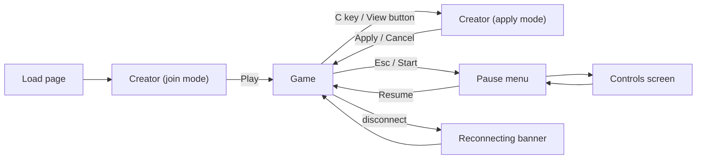

<!-- core:start -->
# UX and accessibility

**Principles.** Controller-first parity with keyboard (both feed the same six-bit input mask and can be used at once). Readable in half a second at 256x224 native with integer scaling. Failure is cheap and understood. Nothing important is conveyed by color alone, sound alone or timing alone. Assists exist, are off by default, are honestly labelled and never sold.

**Screens built today.** Creator (opens first; tabs per option category, steppers, swatches, live animated preview with Idle/Walk/Run/Jump/Stomp/Hurt chips, flip, randomize, reset, look code copy and paste, name, Play or Apply), game view (playfield plus a small pixel-font status panel, floating action prompt, toasts, reconnect banner, debug HUD on F1), pause menu (Resume, Controls), Controls screen (rebinding, deadzone, run hold or toggle, rumble, resets), first-join controls hint, and a `?pad=debug` gamepad overlay. Not built: map, inventory, shop, party, settings beyond controls, level editor, accessibility menu, audio settings.

**Controls.** Six inputs: left, right, jump, run (hold or toggle), crouch (also drop through one-way platforms), action (levers now; mounts and powerups later). Full remapping; up to three bindings per action and device; conflict detection with swap; glyphs adapt to Xbox, PlayStation and Switch layouts.

**Assist options [ACCEPTED-DELEGATED]** (all off by default, mark runs "Assisted", excluded from Classic and Standard boards): extra checkpoints, wider forgiveness frames, slower threats, telegraph boost, practice mode, guided hints, skip-after-N-fails offer. Not yet built.

**Colorblind-safe language.** Gold means needs action or waiting, cyan means powered or done, coral means lever knob or hazard stripes; one-way platforms use a pale slatted lip; each state also has a distinct shape or animation.

**Safety posture [ACCEPTED-DELEGATED interim].** Quick-chat only, no free text; mute, block and report planned; age band and chat posture are OPEN and need Anthony. No analytics, trackers or third-party requests today.

**Gaps.** No reduced-motion support, no audio (so no captions needed yet), no UI scale, no text-size option, no high-contrast mode. These are planned work, listed in section 12.
<!-- core:end -->

# 1. Screens and flows

| Screen | Status | Notes |
|---|---|---|
| Creator (join) | Built | Full-screen on load; `?name=` joins immediately; `?look=` overrides; name and look in `localStorage` (try/catch) |
| Creator (apply) | Built | Name is read-only in this mode; Esc or Cancel closes; game keeps running while open |
| Game view | Built | PixiJS canvas; status panel top-right (shards, flag, deaths, players, "NEEDS n PLAYERS" when a co-op room lacks its minimum) |
| Pause | Built | Resume, Controls; gamepad navigable |
| Controls | Built | Rebind, add, swap on conflict, deadzone 10-50 percent (default 25), run hold or toggle, rumble |
| First-join hint | Built | Dismissible; shows the player's real bindings |
| Gamepad debug | Built | `?pad=debug` |
| Map and discovery | Planned | Fog-of-war per region, waypoints, secret counters, optional hints |
| Inventory, loadouts, presets | Planned | 3 free presets; respec free and instant |
| Skill and mastery screen | Planned | Tree and mastery tracks |
| Party and party finder | Planned | Ready-check for 8-player raids |
| Trading | Planned | Atomic direct trade, confirmation delay, hash of final offer |
| Level editor | Planned | Tile-only v1; validation, base-route proof, moderation |
| Settings and accessibility | Planned | Assist options, text size, contrast, reduced motion |
| Leaderboards, events | Planned | Open, Standard and Classic boards; Assisted runs excluded |

# 2. HUD rules

1. **Minimal.** Keep the 256x224 playfield clear. Status uses the pixel font in the top-right corner with a dark translucent panel. Colors: default `#f6f3ff`, warning `#ffd84a`.
2. **Readable states.** Prompts float above their object and use controller-aware glyphs; they never overlap the name tag (known polish issue to fix).
3. **Local player is obvious.** Yellow name tag with a down arrow; others are neutral; disconnected players render at 40 percent alpha.
4. **Never punish with HUD.** No death counters shaming the player; `deaths` is tracked but display it kindly or not at all in public modes.
5. **One new element at a time** when introducing mechanics; show contextual hints (tutorial hints in `TONE_AND_VOICE.md`).
6. **Debug is separate.** The F1 debug HUD (fps, ping, position, velocities, pending inputs) is not part of the player UI.
7. **Timers and meters** (powerup duration, mount stamina, timed lever ring) must pair color with shape: the timed lever ring drains from full gold to red; also show the count by ring length.
8. **Telegraphs** are bigger and longer for hazards (Telegraph boost assist increases them).
9. **No overlay may hide the player** or the next obstacle during active play.
10. **Safe area:** keep key info within the 256x224 frame; integer scaling means no fractional UI.

# 3. Controller-first parity with keyboard

* Both devices feed one six-bit mask: `LEFT 1, RIGHT 2, JUMP 4, RUN 8, CROUCH 16, ACTION 32`; keyboard and gamepad can be used simultaneously.
* Gamepad uses the browser Gamepad API (Xbox, DualShock 4, DualSense, Switch Pro, most generic pads); nothing to install.
* Every screen is fully usable with a pad: D-pad or stick moves focus (spatial), A or Cross activates, B or Circle goes back, Start closes pause, LB and RB change tabs, LT and RT step values, right stick scrolls. Typing the hero name needs a keyboard (Steam Deck or Steam Input provides one).
* Remapping: up to three bindings per action and device; conflicts tell you which action holds the input; pressing it again swaps; the pause menu keeps at least one binding per device; reset keyboard, gamepad or all.
* Settings: stick deadzone, run hold or toggle, rumble; stored in `localStorage` key `sbh.controls` (schema version 1), and everything still works if storage is blocked.
* Glyphs follow the active pad family (A/B, Cross/Circle, Switch letters by position).
* Rumble fires on hard landings, bounce pads, stomps and respawns (Chromium; toggle in Controls).
* Verification gap: real hardware feel for non-standard-mapping pads is unverified; `?pad=debug` exists for reports (`../CONTROLS.md`).

Default bindings and the complete list live in `../CONTROLS.md` (authoritative).

# 4. Assist options (from `../design/DIFFICULTY_PHILOSOPHY.md`) [ACCEPTED-DELEGATED; not built]

| Assist | Effect | Ranked boards |
|---|---|---|
| Extra checkpoints | Denser checkpoint spacing on required levels | Assisted |
| Wider forgiveness | Extra coyote and buffer frames beyond the shared base | Assisted |
| Slower threats | Pursuer and timed hazards 15 to 30 percent slower; not in raids or events | Assisted |
| Telegraph boost | Bigger and longer warnings, landing shadow (Ledge Sense readout) | Assisted |
| Practice mode | Loop a segment with ghost and slow motion | n/a |
| Guided hints | Opt-in hints after repeated failure; stuck detection offers the nearest solution | Assisted |
| Skip-after-N-fails | After about 10 failed attempts on a mount questline or required segment, offer a simplified variant; never a free skip of raid content | Assisted |

Rules: off by default; toggled in settings; mark runs "Assisted"; excluded from Classic and Standard leaderboards; fully count for progression, mounts and story; never sold, never required; in co-op each player's assist affects only personal conveniences (hints, checkpoints), never shared sync windows or other players' physics.

# 5. Readability rules

1. **Contrast ladder.** Playfield: darkest outlines and brightest saturated lips; backgrounds: compressed value range, cooler and hazier; decoration never imitates a collidable tile.
2. **Silhouettes** are readable at 1x. Hero stays high-contrast against every region theme.
3. **No noise.** No gradients, anti-aliasing or dither on characters; dithering is only for sky bands.
4. **Hazards and goals read at a glance:** spikes have pale tips with coral stripe (known weakness: read white-heavy); doors have a cap and base; plates glow when pressed.
5. **One pixel scale.** Integer scaling only; no fractional zoom; no blur.
6. **Name tags** in the pixel font with a dark panel for contrast.
7. **Night remains readable:** the playfield keeps its contrast at night; fog and weather never hide required hazards.
8. **Telegraph everything required:** invisible requirements are forbidden (G3).
9. **Text.** Prefer short strings; important text is never in a 2.5-second toast alone.

# 6. Colorblind-safe cues

The object art uses a fixed language (`../ART_OBJECTS.md`):

| Color | Meaning | Required companion cue |
|---|---|---|
| **Gold** | Needs action: lock, waiting plate, timer ring | Lock icon or ring shape; plate is unpressed (raised) |
| **Cyan** | Powered or done: pressed plate, open gate, lit emblem | Plate lowered; gate open (shape change); glow animation |
| **Coral** | Lever knob; spike hazard stripes | Spike teeth and stripe pattern; lever knob position (off or on) |
| **Pale slatted lip** | One-way platform | Visible slatted pattern |

Rules: never use red versus green as the only distinction; do not depend on hue between cyan and gold alone for a decision (they differ in lightness and have shape cues); offer a colorblind-friendly palette option in settings later (Planned); test with deuteranopia, protanopia and tritanopia simulations before shipping any new object art. Accents are identical hexes in every region so the language is learnable once.

# 7. Motion and reduced motion

* Today: no `prefers-reduced-motion` handling in the client or site; the creator preview animates; parallax and drifting clouds are always on; screen shake is not used.
* **Planned rules [PROPOSAL]:** honor `prefers-reduced-motion` (stop parallax drift, clouds, ambient particles, looping preview animations); provide an in-game "Reduced motion" toggle; no flashing faster than three flashes per second; lightning (Stormbreak) uses a gentle fade, not strobing; hit-pause and squash are small and optional; camera never shakes.
* Respawn flash and invulnerability flicker are bounded (90 ticks) and should be toggleable.

# 8. Audio and captions

* No audio exists today (no sound code in the client). When added (`AUDIO_DIRECTION.md`): every cue that carries information has a visual twin; offer captions or visual indicators for sounds that matter (for example a switch click or a lightning warning); independent volume for music and effects; mute-all; no required audio for any puzzle.
* Visual-first design: bounce, stomp, shard, gate, lever and plate states are readable without sound.

# 9. Safety and chat posture

| Item | Status |
|---|---|
| Chat today | None |
| Interim default | **Quick-chat only, no free text** [ACCEPTED-DELEGATED, interim] |
| Planned safety tools | Mute, block, report, reviewer queue, moderation log, rate limits, appeals |
| Social tools planned | Quick-chat wheel and emotes, pings, friends and parties |
| Age band, privacy policy, login provider, free-text posture | **OPEN** (Anthony) |
| Quick-chat phrases | Kind, short, localizable (examples in `TONE_AND_VOICE.md`) |
| User-generated names | Name field is 16 characters; filter and report path needed before free naming at scale |
| Supporter names | Opt-in with consent, reviewed, removable (proposal) |
| Data | No analytics, trackers or third-party requests; the waitlist form has no backend in the published build; telemetry for playtests must be local and consented |

# 10. Hard-lock prevention (UX side)

* A stuck player can always leave via waypoint (G8); optional "Pathfinder's Promise" highlights the nearest solution.
* Required gates always have an alternate or loaner (G1).
* Doors never close on a player inside them; lingering gates and reset levers prevent room stalls (`../design/COOP_ROOM_M3.md`).

# 11. Platform notes

* Browser first: Chrome, Edge and Firefox are the target; Safari supports pads but not reliable rumble.
* Touch and mobile are **not** launch targets [ACCEPTED-DELEGATED].
* Steam Deck and Steam Input: pads present as Xbox layout; the in-game remapper stays.
* The tab must be focused for pad input; the Browser hides a pad until a button press (a toast confirms connection).

# 12. Accessibility backlog (priority order, all [PROPOSAL])

1. Assist options screen (extra checkpoints, forgiveness, telegraph boost).
2. Reduced-motion toggle and `prefers-reduced-motion`.
3. High-contrast and colorblind palette options; non-color cues audit on all objects.
4. Text size and UI scale; on-screen keyboard note for name entry on pad-only devices.
5. Audio settings, captions and visual twins when audio ships.
6. Screen-reader pass on creator, pause, controls (already role-annotated).
7. Subtitles and localization-ready string catalog.
8. Photosensitivity review for effects (lightning, flashes, sparkles).
9. Practice mode and ghost replay.
10. Crouch hero frame and clearer hurt feedback for low vision.

# 13. UX review checklist

- [ ] Works with keyboard only, gamepad only, and both.
- [ ] Every control reachable by focus; labels present.
- [ ] No color-only meaning; not sound-only; not timing-only.
- [ ] Reduced-motion variant specified.
- [ ] Copy follows `TONE_AND_VOICE.md`.
- [ ] No overlay covers the player or next hazard.
- [ ] Failure is cheap; retry is under about a second.
- [ ] Safe under `localStorage` blocked.
