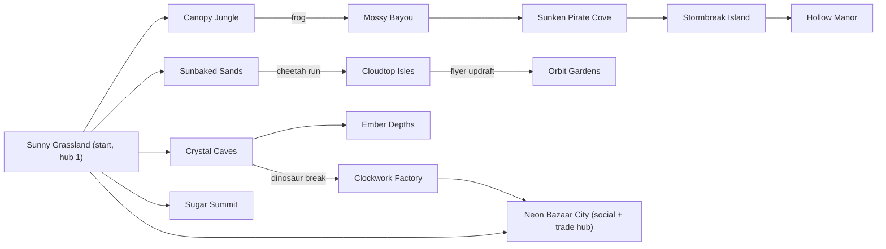

<!-- core:start -->
# World bible

The world is a shared, side-scrolling, Metroidvania-style open world made of fourteen themed regions. The region **themes** are [CONFIRMED] from Anthony's brief (starter grassland, mechanical factory, jungle, underwater linked to a pirate area, caves, sky, lava, stormy island, haunted, space, swampy bayou, dessert/candy, sandy desert, bustling city); the working **names, hooks and zone graph** are [PROPOSAL] from the GDD. Not all regions are required at launch. First content slice [ACCEPTED-DELEGATED]: Sunny Grassland, Crystal Caves, Clockwork Factory; Neon Bazaar City hub later.

Implementation reality: only **Sunny Grassland** and **Crystal Caves** have real art (three tilesets: meadow, meadow sunset, caverns) and run in the prototype; dawn, day, sunset and night Blender backdrops exist for the meadow scene. The other twelve are creative direction with rough procedural concept sketches on the public site, no tiles, no levels.

Each region follows "one world, one mood": an instantly identifiable theme color and feel (art north star), gentle layered parallax, a clear tileset with high-contrast solid ground and soft decoration. Every region should teach or reward something: a mount, a gate type, a hazard family or a co-op primitive. Zone modifiers (low gravity, ice, water, wind) affect everyone equally and so do not violate base-moveset fairness.

Regions connect as a loose Metroidvania graph: Sunny Grassland is hub one; Neon Bazaar City is the social and trade hub. Gates are mounts, abilities, switches, co-op plates, skill tests or knowledge; every required gate has a loaner or alternate route (G1) and is telegraphed (G3). Time of day (dawn, day, sunset, night) is a visual and mood layer that never changes physics. Mount homes, music, creatures and hazards below are proposals unless stated.
<!-- core:end -->

# 1. Rules every region obeys

| Rule | Detail | Tag |
|---|---|---|
| One world, one mood | Instantly identifiable theme color and mood per region | CONFIRMED (art north star) |
| Cheerful readability | Playfield has the darkest outlines and brightest lips; backgrounds are lower-contrast, cooler and hazier | CONFIRMED (art docs) |
| 16x16 flat tile language | What you can stand on looks solid and high-contrast; decoration looks soft and never imitates a collidable tile | CONFIRMED (art docs) |
| Fairness | Zone modifiers affect everyone equally; required routes are base-clearable | CONFIRMED (brief) / ACCEPTED-DELEGATED |
| No hard-locks | G1 to G9 gate rules in the GDD apply | ACCEPTED-DELEGATED |
| Danger is in the platforming | Spooky or stormy regions use mood, not grimness; nothing muddy | CONFIRMED (art north star) |
| Originality | No region copies another game's world theme art, music or enemies | CONFIRMED |
| Real money | No region, shop or minigame involves real-money gambling | CONFIRMED |

Palette notes below are descriptive color families, not final hex values. The only locked color facts are: tilesets use exactly 16 colors (4 cover, 4 earth, 3 stone, 2 timber, 3 accent), the deepest ink is `#2b2350`, highlights drift warm yellow, shadows drift cool blue-violet (`../ART_DIRECTION.md`, `../ART_WORLD.md`).

# 2. Zone graph [PROPOSAL; real graph OPEN]

Notes: edges are creative direction. The first slice (Grassland, Caves, Factory) is connected by the Grassland to Caves and Caves to Factory edges. Metroidvania backtracking is intended: later mounts open earlier regions' secrets. A **waypoint** network (visited-waypoint fast travel, never inside instances) and per-region fog-of-war maps are proposed (GDD 5.5).

# 3. Region entries

Status key: **Real art** = tiles, backdrops and props exist and run in the prototype. **Concept** = rough procedural sketch on the public site only. **Name only** = nothing exists.

For music cues see `AUDIO_DIRECTION.md`. For creatures, the three existing species are Sproutling, Zipwing and Shardback (`CHARACTERS_AND_CREATURES.md`); additional creature families named here are [PROPOSAL] working ideas and not designed.

## 3.1 Sunny Grassland (starter)

| Field | Entry |
|---|---|
| Brief theme | Starter grassland-like area [CONFIRMED] |
| Mood | Welcoming, bright, safe; the first ten minutes of the game |
| Palette | Sky blue, bright green grass lip, warm brown earth, white clouds, pale sun; sunset variant coral and purple |
| Signature gameplay | Gentle slopes, bounce pads, first pit and first wall; teaches walk, run, variable jump, stomp-bounce |
| Hazards | Pits, simple patrollers (Sproutling), a few spikes in later areas |
| Creatures | Sproutling, Zipwing; frogs at the pond (frog mount home) |
| Music/sound | Light, bouncy major-key theme; birdsong ambience; day and sunset variants |
| Teaches / mount | Base moveset; **frog** questline early so the confirmed frog gate is not a long wait [ACCEPTED-DELEGATED principle] |
| Graph | Hub one; connects to Jungle, Sands, Caves, Sugar Summit, Bazaar City |
| Landmarks | Tall tree, fence, pond, windmill (sunset), floating shard islet in the distant sky, stone pillars with shard-gem inlay |
| Status | **Real art** (meadow and meadow_sunset tilesets, 8 parallax layers, props, gameplay objects; Blender dawn/day/sunset/night backdrops). Playground level `playground` is the shared test space |

## 3.2 Crystal Caves

| Field | Entry |
|---|---|
| Brief theme | Caves [CONFIRMED] |
| Mood | Quiet, glowing, a little mysterious but still friendly |
| Palette | Violet stone, cyan and magenta crystals, green cap lip, soft light shafts |
| Signature gameplay | Precision ledges, dark stretches lit by crystals, stalactite overheads, shard gems |
| Hazards | Narrow ledges, spikes, Shardback crawlers (not stompable), drips as ambience only |
| Creatures | Shardback (slate with magenta crystals) |
| Music/sound | Sparse, resonant, sampler-bell flavor; dripping and crystal chimes |
| Teaches / mount | Precision; **dinosaur** (cracked-block ground-pound) is the proposed gate toward the Factory |
| Graph | Grassland to Caves; Caves to Factory (dinosaur break) and to Ember Depths |
| Status | **Real art** (caverns tileset, 4 parallax layers, props, objects; first slice priority) |

## 3.3 Clockwork Factory

| Field | Entry |
|---|---|
| Brief theme | Mechanical factory [CONFIRMED] |
| Mood | Busy, rhythmic, warm brass and steel; a toy-box industry |
| Palette | Brass, teal steel, orange glow, steam white; conveyor stripes in gold |
| Signature gameplay | Timing hazards, conveyors, steam vents, rhythm rooms; puzzle boss Clockwork Conductor (four gear-switches in rhythm) |
| Hazards | Crushers on rhythm, steam bursts, conveyors, spikes |
| Creatures | Proposal: small clockwork critters; Zipwing-like flyers |
| Music/sound | Percussive, ticking, syncopated loops; machine hums mixed low |
| Teaches / mount | Timing and rhythm; dinosaur breaks as shortcuts |
| Graph | Caves to Factory; Factory to Neon Bazaar City |
| Status | **Name only / Concept** (site sketch). First-slice priority |

## 3.4 Canopy Jungle

| Field | Entry |
|---|---|
| Mood | Dense, lush, secret-rich |
| Palette | Deep greens, dappled gold light, vine browns, firefly yellow |
| Signature gameplay | Vertical climbing, leaf platforms, hidden shortcuts |
| Hazards | Falls, swinging vines, thorn patches (dinosaur-gated thorns) |
| Creatures | Proposal: leaf-hoppers, canopy gliders |
| Music/sound | Marimba and wood-block rhythm, birds and insects |
| Teaches / mount | Frog and flyer shortcuts; secrets |
| Graph | Grassland to Jungle; Jungle (frog) to Mossy Bayou |
| Status | **Concept** |

## 3.5 Sunken Pirate Cove (underwater and pirates)

| Field | Entry |
|---|---|
| Brief theme | Underwater region linked to a pirate area [CONFIRMED] |
| Mood | Adventurous, a little salty; stories still aboard the wreck |
| Palette | Teal and deep blue water, sand yellow, weathered timber, coral accents |
| Signature gameplay | Swim zones (swim is a zone-provided proposal), currents, wreck exploration; puzzle boss Tideknot (valves and currents) |
| Hazards | Currents, urchin-like spikes, timed bubbles |
| Creatures | Proposal: fish schools as ambience, crab-like patrollers |
| Music/sound | Muffled, slow-wave arrangement underwater; sea-shanty-flavored surface theme (original) |
| Teaches / mount | Frog underwater passages; Bubble Helm powerup |
| Graph | Bayou to Cove; Cove to Stormbreak Island |
| Status | **Concept** |

## 3.6 Cloudtop Isles (sky)

| Field | Entry |
|---|---|
| Mood | Airy, vertigo-tinged but cheerful |
| Palette | Pale blue, white clouds, golden grass islands, rainbow-tinted mist |
| Signature gameplay | Big jumps, updrafts, floating islands, long falls with checkpoints |
| Hazards | Falls, wind gusts, crumbling clouds |
| Creatures | Proposal: birds, cloud puffs |
| Music/sound | Wide, airy pads and bright arps; wind bed |
| Teaches / mount | **Flying dinosaur** (stamina flap-glide, updrafts) |
| Graph | Sands (cheetah run) to Cloudtop; Cloudtop (flyer) to Orbit Gardens |
| Status | **Concept** |

## 3.7 Ember Depths (lava)

| Field | Entry |
|---|---|
| Mood | Hot, high-stakes, dramatic but still saturated, not grim |
| Palette | Obsidian purple-black, molten orange and yellow, ember sparks |
| Signature gameplay | Hazard-heavy stepping stones, rising and falling lava, speed gates |
| Hazards | Lava (touch means retry), fireballs from vents, crumbling stone |
| Creatures | Proposal: magma-shell crawlers (not stompable), ember sprites |
| Music/sound | Driving low brass-synth, heavy pulse, crackle |
| Teaches / mount | Cheetah speed gates |
| Graph | Caves to Ember Depths |
| Status | **Concept** |

## 3.8 Stormbreak Island (stormy)

| Field | Entry |
|---|---|
| Mood | Dramatic weather, lighthouse beacon, hopeful under the storm |
| Palette | Slate sea, striped lighthouse, lightning white and yellow, teal rain |
| Signature gameplay | Weather timing (lightning paths), lighthouse climb; puzzle boss Storm Warden (grounded stomp-bounce vs airborne timing) |
| Hazards | Lightning strikes telegraphed by flashes, slick wet platforms, waves |
| Creatures | Proposal: gulls, storm sprites |
| Music/sound | Rolling toms and strings, thunder as a rhythm cue (always visually telegraphed) |
| Teaches / mount | Flyer and cheetah |
| Graph | Pirate Cove to Stormbreak; Stormbreak to Hollow Manor |
| Status | **Concept** |

## 3.9 Hollow Manor (haunted)

| Field | Entry |
|---|---|
| Mood | Spooky-cute, mysterious, puzzle-forward, never gory |
| Palette | Moon-white, indigo, candle yellow, ghost teal |
| Signature gameplay | Light and shadow puzzles; only lit players count for plates; lantern relay; puzzle boss The Gloom Choir |
| Hazards | Dark rooms (with readable cues), trick floors, drifting ghosts |
| Creatures | Proposal: friendly-looking ghosts that may not be; bats |
| Music/sound | Celesta and pizzicato, music-box melody, creaks mixed low |
| Teaches / mount | Co-op light relay; Hollow Lantern powerup |
| Graph | Stormbreak to Hollow Manor |
| Status | **Concept** |

## 3.10 Orbit Gardens (space)

| Field | Entry |
|---|---|
| Mood | Quiet, wondrous, playful physics |
| Palette | Deep violet-black, ringed orange planet, nebula pink and cyan |
| Signature gameplay | Low-gravity and low-grip drift zones (zone modifiers affect everyone), asteroid platforms |
| Hazards | Falling into the void, drift overshoot, station machinery |
| Creatures | Proposal: asteroid critters, small satellites |
| Music/sound | Shimmering synth pads, slow arps, soft pings |
| Teaches / mount | Flyer; Drift Sail and Gale Charm interactions |
| Graph | Cloudtop (flyer updraft) to Orbit Gardens |
| Status | **Concept** |

## 3.11 Mossy Bayou (swampy)

| Field | Entry |
|---|---|
| Mood | Cozy-murky, fog and fireflies, a stilt shack with one lit window |
| Palette | Olive and moss greens, amber window light, mist gray-teal |
| Signature gameplay | Lily-pad hopping, floating logs, fog reveals |
| Hazards | Water gaps, sinking logs, snapping plants |
| Creatures | Proposal: frog families, fireflies |
| Music/sound | Slow slide-guitar-flavored lines (original), frog chorus ambience |
| Teaches / mount | **Frog** (lily-pad hops, tether anchors) |
| Graph | Jungle (frog) to Bayou; Bayou to Pirate Cove |
| Status | **Concept** |

## 3.12 Sugar Summit (dessert: cakes and candy)

| Field | Entry |
|---|---|
| Brief theme | Dessert region with cakes and candy [CONFIRMED], separate from the sandy desert |
| Mood | Whimsical, bouncy, the happiest region |
| Palette | Pastel pinks, mint, chocolate brown, frosting white, cherry red |
| Signature gameplay | Sticky and bouncy surfaces (zone modifiers), layered cake towers, candy-cane ramps |
| Hazards | Melting syrup pits, hard-candy spikes |
| Creatures | Proposal: gumdrop walkers |
| Music/sound | Music-box, toy piano, kazoo-bright lead |
| Teaches / mount | Any; a low-pressure region to play with mounts |
| Graph | Grassland to Sugar Summit |
| Status | **Concept** |

## 3.13 Sunbaked Sands (sandy desert)

| Field | Entry |
|---|---|
| Brief theme | A separate sandy desert [CONFIRMED] |
| Mood | Huge sky, big sun, hard-earned oasis |
| Palette | Gold sand, sandstone orange, oasis teal, sky pale blue |
| Signature gameplay | Dunes, ruins, timed sand gates; puzzle boss Dune Wyrm Clock (cheetah-speed relay, raid-only loaner) |
| Hazards | Sinking sand, crumbling bridges, heat shimmer (visual only) |
| Creatures | Proposal: scarab-like walkers, lizards |
| Music/sound | Hand-percussion and plucked-string flavor (original), long reverb |
| Teaches / mount | **Cheetah** (sprint dash, steep slopes, long leaps) |
| Graph | Grassland to Sands; Sands (cheetah run) to Cloudtop |
| Status | **Concept** |

## 3.14 Neon Bazaar City (bustling city)

| Field | Entry |
|---|---|
| Brief theme | Bustling city with shopping and trading [CONFIRMED] |
| Mood | Social, warm evening glow, a place to meet |
| Palette | Dusk indigo, neon pink and cyan signs, lamp yellow, market-stall colors |
| Signature gameplay | A social and trade channel rather than a gauntlet: stalls, direct trade (atomic, per delegated decision), party finder, mini-games later |
| Hazards | Minimal; light platforming play spaces |
| Creatures | Players; cat and dog NPCs in later lore |
| Music/sound | Jazzy bass and bright electric piano, crowd murmur, clock-tower chime |
| Teaches / mount | Social systems; mount parking and showing off |
| Graph | Factory to City; Grassland to City; later home of the cat construction site |
| Status | **Concept**. Hub, later in the slice order |

# 4. Time of day

| Time | Meaning | Status |
|---|---|---|
| Dawn | Soft pink and gold, cool shadows | Blender backdrop exists |
| Day | The default bright read | Blender backdrop and hand-authored meadow exist |
| Sunset | Coral clouds, purple mountains, warmer ground grade | Blender backdrop exists; `meadow_sunset` tileset is an automatic palette grade, not hand-tuned |
| Night | Deep blue, lit windows and glow accents | Blender backdrop exists |

* Today: selectable via `?tod=dawn|day|sunset|night`, cycled in debug with `,` and `.`; four Blender backdrops of nine layers each, plus pre-rendered props (`../ART_BLENDER_PIPELINE.md`).
* **Rules [PROPOSAL]:** time of day is a mood and readability layer. It never changes physics, hitboxes, hazards or required routes. Night must stay readable (dark outlines on lighter ground; the playfield keeps its contrast). Some secrets may appear only at certain times (cosmetic and lore rewards only, never required power). Whether time follows real time, a world clock or per-region fixed time is **[OPEN]** (O14).
* A region may lock a time (the Haunted manor stays night; Sugar Summit stays day) for identity.

# 5. Per-region implementation checklist

When adding a region (see also `CHANGE_PROTOCOL.md`):

1. Mood line, palette family, signature gameplay, hazard list, creature list, music cue, mount or ability taught, graph edges, gate telegraphs.
2. Tileset of exactly 16 colors with shared tile ids (switching region swaps the image); autotile rules; props with `solid:false`; 4 to 8 parallax layers.
3. Gameplay-object art (plates, levers, doors, spikes, flags, shards) tinted per region with identical accent hexes (gold, cyan, coral).
4. At least one level with a base-route proof once the proof system exists; checkpoints; difficulty tier tags.
5. Secrets list and Easter-egg placements (rewards cosmetic or lore).
6. Tone and copy review; audio brief; accessibility review (contrast, motion, colorblind cues).

# 6. Open region questions

* Real zone graph and shipping order beyond the first slice (O13).
* Whether regions have their own channels and caps (O10).
* Final region names (all current names are working names).
* Which region hosts the cat construction site and how it connects to the Bazaar (`LORE_BIBLE.md`).
