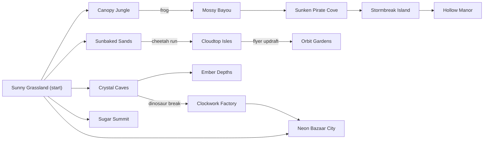
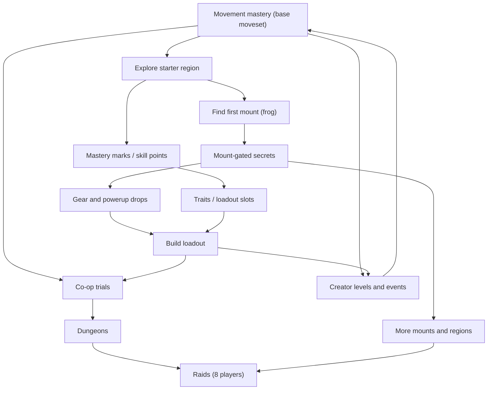

# Super BoundHaven (SBH): Master Game Design Document

Version 0.2, 2026-09-30 (owner answers recorded). Working title; independent project, unrelated to Anthony's other projects. This is the single document that aligns the brief, the decisions log, the mounts/exploration doc, the art north star, the M1 spec and the public site.

## How to read this document

| Badge | Meaning |
|---|---|
| **[CONFIRMED]** | Anthony's own words (design brief, accepted-decisions log, owner answers of 2026-09-30, owner direction in the art north star). Source is named. |
| **[ACCEPTED-DELEGATED]** | Anthony said "I'll let you decide" (2026-09-30); Claude adopted its documented recommendation. Binding for development; revisable by Anthony any time. |
| **[PROPOSAL]** | Claude's design suggestion awaiting Anthony's approval. Never treat as decided. Money, legal exposure, real-world risk and public promises stay here until Anthony decides. |
| **[OPEN]** | Unresolved question; needs an answer (see section 14). |

Ground rules that apply everywhere **[CONFIRMED]**: original assets and designs only (no third-party assets or mocap, 2026-09-30); no promises of dates, prices or rewards; long-term, open-ended scope ("no feature too big, no addition too small", DECISIONS 2026-09-30), so every system is designed for extensibility and phased. Do not import the other projects' rules. No real-money gambling is assumed. Licensing **[CONFIRMED]** 2026-09-30: code MIT; art, music, content and docs CC BY-NC-SA 4.0; name and logo reserved.

Related docs: `DESIGN_BRIEF.md`, `DECISIONS.md`, `OPEN_QUESTIONS.md`, `docs/design/DIFFICULTY_PHILOSOPHY.md`, `docs/design/MOUNTS_AND_EXPLORATION.md`, `docs/design/SKILL_TREE_AND_ABILITIES.md` (detail tables), `docs/ART_NORTH_STAR.md`, `docs/superpowers/specs/2026-09-30-sbh-m1-shared-playground-design.md`.

### Confirmed register (Anthony's words; everything else in this doc is proposal or open)

| Confirmed item | Source |
|---|---|
| Mount roster: frog, dinosaur, flying dinosaur, cheetah; **no wolf planned** (more animals possible later) | DECISIONS log 2026-09-30; Anthony's answer 2026-09-30 |
| Difficulty: challenging but not too difficult; **mounts must not be hard to get** | Anthony 2026-09-30; `DIFFICULTY_PHILOSOPHY.md` |
| Base moveset gains **crouch/down** (and drop-through) and **action/activate**: six inputs | Anthony 2026-09-30 |
| Skill model: **both** skill-point tree and mastery-by-use, with **free respecs** | Anthony 2026-09-30 |
| Raids: **8 players** (cap 8); smaller co-op rooms for 2 to 4 | Anthony 2026-09-30 |
| Character creator: add front/three-quarter face views to the preview, evaluate visually; side-view faces stay for gameplay | Anthony 2026-09-30 |
| Strictly original: no third-party assets or mocap | Anthony 2026-09-30 |
| Open-source: code MIT; art/music/content/docs CC BY-NC-SA 4.0; name and logo reserved | Anthony 2026-09-30 |
| Mounts summonable anytime in the open world | same |
| Some levels/areas require a specific mount; Metroidvania-style exploration with secrets and Easter eggs | same |
| Art: Super Mario World essence (bones, inspiration), 100% original designs, no cubes | ART_NORTH_STAR owner direction 2026-09-30 |
| Layered humanoid character creator with much larger customization | ART_NORTH_STAR ("Terraria-style" wording is from the task request; not yet in DECISIONS) |
| Long-term, open-ended scope: no feature too big, no addition too small | DECISIONS log 2026-09-30 |
| Shared multiplayer playground from day one; TypeScript stack; prediction + server authority; player collision; 256x224 placeholder art | DECISIONS log 2026-09-30 |
| Precise SMW-like movement, skill gap, original powerups/mounts, genuine co-op, hard raids (size now decided: 8), uploads, weekly featured, mirror/pursuer, region list, cat casino lore (no real gambling), tradeable functional gear | DESIGN_BRIEF |

## Table of contents

1. [Vision, pillars, audience, tone, platform](#1-vision-pillars-audience-tone-platform)
2. [Core movement and the base moveset](#2-core-movement-and-the-base-moveset)
3. [Abilities system and powerups](#3-abilities-system-and-powerups)
4. [Skill tree](#4-skill-tree)
5. [Mounts and Metroidvania exploration](#5-mounts-and-metroidvania-exploration)
6. [Gear, equipment and cosmetics](#6-gear-equipment-and-cosmetics)
7. [Co-op dungeons and raids](#7-co-op-dungeons-and-raids)
8. [Levels, open world, regions, community levels and events](#8-levels-open-world-regions-community-levels-and-events)
9. [Economy and items](#9-economy-and-items)
10. [Social and community](#10-social-and-community)
11. [Progression flow](#11-progression-flow)
12. [Technical design implications and roadmap](#12-technical-design-implications-and-roadmap)
13. [Consistency audit](#13-consistency-audit)
14. [Resolved decision log](#14-resolved-decision-log)

---

## 1. Vision, pillars, audience, tone, platform

### 1.1 Vision
SBH is an independent 16-bit-style side-scrolling **platforming MMO**: precise movement with a real skill gap, a shared open world where other players are visible and physically interact, genuinely cooperative dungeons and raids, and community-made levels. **[CONFIRMED]** (DESIGN_BRIEF "Identity and platform"; "Movement, challenge, and replayability").

### 1.2 Pillars
| # | Pillar | Status | What it means in design |
|---|---|---|---|
| P1 | **Movement is the skill** | **[CONFIRMED]** (brief) | Base moveset is deep; challenge is mostly precision platforming and timing |
| P2 | **Fair, forgiving, endlessly retryable** | **[CONFIRMED]** ("challenging, fair, forgiving enough to encourage retries") | Fast retry, clear telegraphs, instant retry plus checkpoints on long levels **[ACCEPTED-DELEGATED]** |
| P8 | **Challenging, but not too difficult; mounts approachable** | **[CONFIRMED]** (Anthony 2026-09-30) | Hardest content stays optional/endgame; mounts obtainable by an average player with moderate effort; assists and checkpoints exist; see `DIFFICULTY_PHILOSOPHY.md` |
| P3 | **Together is the point** | **[CONFIRMED]** (brief) | Players are solid; co-op requires coordinated execution, not solo carries |
| P4 | **Explore and discover** | **[CONFIRMED]** (decisions log: Metroidvania-style world, secrets, Easter eggs) | Gates, secrets, map, curiosity rewarded |
| P5 | **Gear eases, never replaces** | **[CONFIRMED]** (brief) | Build expression without breaking the skill ceiling |
| P6 | **Made by everyone** | **[CONFIRMED]** (uploads, weekly featured) | Creator tools and community events are first-class |
| P7 | **Original, cheerful, readable** | **[CONFIRMED]** (art north star, owner direction) | SMW *essence* (bold, chunky, cheerful), 100% original designs |

### 1.3 What SBH is / is not
| Is | Is not |
|---|---|
| An independent platformer MMO with mounts, raids, editor | A clone or reskin of any Nintendo game; no copied characters, tiles, enemies, music or levels **[CONFIRMED]** |
| Skill-first, gear-assisted | Pay-to-win (no paid power **[ACCEPTED-DELEGATED]**; monetization terms still need Anthony, section 9) |
| Browser first, Steam later | Launch-date-bound; no date promised **[CONFIRMED]** |
| Open-ended and extensible | A fixed launch feature list; not all regions required at launch |
| Fictional cat/casino lore later | A real-money gambling product **[CONFIRMED]** (none assumed) |

### 1.4 Audience and tone
Audience: players who like precise platformers and social games; references for *feel and community* are MapleStory, PokeMMO, Club Penguin, WoW (not content reuse) **[CONFIRMED]**. Age band and chat posture **[OPEN, needs Anthony]** (decision 15; interim development default is quick-chat only); accessibility follows `DIFFICULTY_PHILOSOPHY.md` assists. Tone: bright, friendly, quirky humor (e.g. the cat-staff lore) **[CONFIRMED]** in lore; danger is in the platforming, not grimness (art north star: "nothing muddy, nothing grim").

### 1.5 Platform plan
Browser first; Steam later with browser/Steam cross-play **[CONFIRMED]**. Stack accepted 2026-09-30: TypeScript end to end, Vite + PixiJS client, Node + `ws` authoritative server, shared deterministic `@sbh/sim`; client prediction + server authority + reconciliation, remote interpolation **[CONFIRMED]** (decisions log). Input devices **[ACCEPTED-DELEGATED]** 2026-09-30: keyboard first, then gamepad; touch/mobile is not a launch target (M1 spec lists touch out of scope). Six inputs (section 2.2). Steam cross-play design constraints: no browser-only assumptions in protocol; stable account linking **[OPEN]**.

### 1.6 Art north star pointer
`docs/ART_NORTH_STAR.md` governs all visual decisions: SMW essence, dark hue-matched outlines, flat 2-3 tone shading, stout humanoid characters (no cubes), 16x16 tile language, 256x224 native with integer scaling (placeholder art accepted). Signature motifs to invent: spring/coil/bounce-ring, "haven shards". Every powerup/mount/gear concept below must pass that page.

---

## 2. Core movement and the base moveset

**Status:** M1 movement is implemented in `packages/sim` **[CONFIRMED]** as accepted direction; numbers are original tuning (config.ts: "no third-party game data used"). Final feel **[OPEN]** until Anthony playtests.

### 2.1 Simulation facts (from `packages/sim/src/config.ts` and `step.ts`)
Tick 60 Hz, tile 16 px, screen 256x224 (16x14 tiles), hitbox 14x28, position units px, inputs = 4 bits today (LEFT, RIGHT, JUMP, RUN); target is six (adds DOWN and ACTION, section 2.2; sim work in M4).

| Quantity | Value in config | Derived (approx., continuous physics) |
|---|---|---|
| Walk max | 1.4 px/tick | 84 px/s, about 5.3 tiles/s |
| Run max | 2.6 px/tick | 156 px/s, about 9.8 tiles/s |
| Ground accel / skid / friction | 0.07 / 0.22 / 0.10 | Walk speed reached in about 0.33 s; run speed in about 0.6 s; reversal skids hard |
| Air accel | 0.06 | Momentum mostly preserved; limited air steering |
| Jump velocity | 5.2 + 0.1 x \|vx\| | Standing full-hold apex about 61 px (about 3.8 tiles); at run speed about 68 px (about 4.2 tiles) |
| Gravity held (rising, jump held) / fall or released | 0.22 / 0.42 | Tap jump apex about 32 px (about 2 tiles): variable jump range about 2 to 4.2 tiles |
| Max fall | 5.5 px/tick | 330 px/s |
| Coyote / buffer | 5 ticks (83 ms) / 6 ticks (100 ms) | Config values "to A/B"; adoption as permanent base **[OPEN]** |
| Bounce pad | 6.6 (8.2 with jump held) | about 3 tiles tap / about 9.5 tiles held (continuous approximation) |
| Player stomp bounce | 4.6 (6.2 held), victim pushed down 1.5 | about 1.6 tiles / about 5.4 tiles |
| Player push | max 1.5 px/tick separation | Soft side push between players |
| Run-jump distance | | Airtime about 41 to 43 ticks: about 3.6 tiles walking, about 6.5 to 7 tiles at run speed |
| Slopes | 45 degrees, snap-down 4 px | Keeps speed smooth on ramps |

Playground gates built from these: 5-tile pit needs a run-jump; 4-tile wall needs a run-jump (about 64 px vs about 68 px run apex); 6-tile wall (96 px) cannot be cleared solo but can with a friend's held-jump stomp (friend's head plus about 87 px). Fall off level = respawn at spawn (no checkpoints yet).

### 2.2 Base moveset (what every player always has) [CONFIRMED that one exists; exact list PROPOSAL where marked]

| Move | In sim now | Note |
|---|---|---|
| Walk / run (RUN button) with accel, friction | Yes | Walk vs run top speed distinction is a core skill lever |
| Skid on reversal | Yes | Tension between commitment and control |
| Variable-height jump | Yes | Hold = high, release = cut |
| Run-speed jump bonus | Yes | Momentum rewards |
| Momentum preserved in air | Yes | |
| Coyote time, jump buffer | Yes (config) | Shared feel for everyone **[ACCEPTED-DELEGATED]** (base, not a purchasable stat) |
| Slopes (45 degrees), snap | Yes | |
| Bounce pads (held-jump boost) | Yes | |
| Stomp-bounce on players (held-jump boost) | Yes | The co-op primitive |
| Soft push between players | Yes | |
| Crouch / drop-through semi-solids (DOWN) | Not yet (M4) | **[CONFIRMED]** 2026-09-30; semi-solids exist in the tile language |
| Action / Activate (ACTION) | Not yet (M4) | **[CONFIRMED]** 2026-09-30; interact with switches, summon/dismount mount, use powerup, trigger mount ability. Pure movement routes never require it beyond level-provided switches |
| Swim | No | **[PROPOSAL]**, zone-provided |

**Six inputs [CONFIRMED]:** LEFT, RIGHT, JUMP, RUN, DOWN (crouch), ACTION. The input byte widens from 4 to 6 bits; the server validates the mask per ruleset (section 12.1).

**Reference provenance [CONFIRMED]:** SMW movement study is intended only to understand behavior; no Nintendo code, assets, ROMs or extracted data go into SBH; any reference study is logged in the M1 spec provenance. Original tuning stays in `config.ts`.

### 2.3 The base-moveset rule **[CONFIRMED]**
"The base moveset must still make hard content possible, though exceptional top-level skill may be required unequipped" (brief). Design definition **[PROPOSAL]**:

- **Base-clearable:** every *required* route is completable with L0 only (no traits, gear, powerups, or mounts unless the level provides them), at high skill.
- **Co-op variant:** base-clearable *by the required team size*, with team mechanics (bounces, switches). The 6-tile wall is intentionally not solo-clearable; that is a co-op design, not a violation.
- **Proof:** every published or official level carries a **base route proof**: a recorded input replay validated by the deterministic sim on the server (section 12). Levels without a proof cannot be tagged "required path" or enter ranked events.
- **Routes may differ:** optional ease routes can require gear/mounts; the proof only covers the critical path, so not every route is identical.

---

## 3. Abilities system and powerups

Detailed tables live in `docs/design/SKILL_TREE_AND_ABILITIES.md`. All **[PROPOSAL]** unless stated.

### 3.1 Taxonomy
| Layer | Examples | Acquired by | Lifetime |
|---|---|---|---|
| **L0 Base move** | Run, variable jump, stomp-bounce | Everyone from the start | Permanent |
| **L1 Trait** | Small passive/convenience (from mastery unlocks or tree) | Exploration/feats/points | Permanent, equippable |
| **L2 Mount ability** | Frog super-hop, cheetah dash | Owning and summoning a mount | While mounted |
| **L3 Powerup** | Consumable/temporary effects | Level pickups, crafting, drops | Seconds or charges |
| **L4 Gear effect** | Bounded passive stats | Loot, crafting, trading | While worn |
| **Env** (not an ability) | Low-gravity zone, ice | Level data | In zone |

**Stacking/conflict:** server resolves one `MovementProfile` per player: base, then traits and gear (additive %, clamped by the **Movement Budget**), then powerup layer, then mount swap, then zone modifier, then hard per-stat ceiling. Same-stat powerups do not stack; conflicting powerups are suspended while mounted. Budget numbers and flow diagram are in the detail doc (section 5 and 2).

### 3.2 Fairness and rulesets **[ACCEPTED-DELEGATED]** 2026-09-30 (Open/Standard/Classic, Classic = normalized leaderboard)
| Ruleset | Allows | Use |
|---|---|---|
| **Open** | All layers | Overworld, raids, most creator levels |
| **Standard** | Non-movement traits, capped movement traits/gear, level-provided pickups | Default race/time-attack |
| **Classic** (normalized/unequipped) | Base moveset, non-movement UI traits, level-provided pickups and loaner mounts only | Purist leaderboard |

Normalized/unequipped leaderboards were a brief proposal; accepted by delegation 2026-09-30. Every leaderboard entry stores the ruleset and a profile hash. A self-imposed **Purist Mark** (tree node F7) tags unequipped runs for fun.

### 3.3 Powerups: original concepts
Design rules: no mushrooms, capes/feathers, invincibility stars, fire flowers, or tongue-eats-enemy. A player carries at most **2** powerups (slot count **[OPEN]**), used with ACTION; timed ones show a clear meter. Durations are starting numbers **[OPEN]**. Ruleset key: **O** Open, **S** Standard (only when level-provided), **C** Classic (only when level-provided). "Level-provided" = placed in the level as a fixed pickup.

| # | Powerup | Effect | Duration / charges | Counterplay / limits | Fairness note |
|---|---|---|---|---|---|
| 1 | **Coil Spring** | Next 3 ground jumps, pad bounces or stomps launch about 30% higher | 3 charges, or 20 s | Uses up fast; over-bounce into ceilings is a risk | O; level-provided in S/C; capped by budget ceiling |
| 2 | **Haven Shard Ward** | Absorbs one hit/hazard touch, then shatters into pickup shards that briefly float | 1 hit, or 30 s | Does not stop pits/crush/pursuer kill zone | O, S level-provided; "hit" model **[OPEN]** |
| 3 | **Gale Charm** | Up to 2 short upward puffs in mid-air (about 1 tile each) | 2 charges, 25 s | Puffs cost momentum; nullified in no-fly zones; cannot exceed jump ceiling | O; level-provided in S; designers mark "no air puffs" cells |
| 4 | **Drift Sail** | Hold jump to fall slowly (cap about 1 px/tick) and keep speed | 15 s | Slow fall is easier to hit with hazards; cannot gain height | O; suspended on flyer mount |
| 5 | **Tether Ribbon** | Links you to the nearest ally within 8 tiles; linked stomps give both the held-jump bounce height without holding | 30 s | Ally must also accept; breaks at range | Co-op only; O and raids (raid can disable) |
| 6 | **Echo Anchor** | Drop an echo; press ACTION to snap back to it once | 20 s, 1 recall | Cannot recall across zones; does not reset hazards or timers | Disabled in races/time attacks (S/C off) |
| 7 | **Magnet Mitt** | Pulls nearby coins/shards/pickups in a radius | 30 s | Pure convenience; no access to hidden blocks | Allowed in all rulesets (non-movement) |
| 8 | **Grip Dust** | Doubles ground friction/skid on ice/oil; stable stopping | 30 s | Hurts top-speed momentum tricks | O; capped by grip budget |
| 9 | **Ballast Bell** | Heavy: cannot be pushed by players, fall speed +25%, jump -10% | 30 s | Tradeoff; makes you an immovable "step" in co-op but worse at leaping | Co-op utility; O only |
| 10 | **Hollow Lantern** | Reveals hidden blocks/secret outlines within about 5 tiles | 40 s | No power gain; shows outlines only | Info; allowed in all, but Classic leaderboards may disable for secrets-hunt events |
| 11 | **Hush Hourglass** | Slows timed hazards (crumble timers, conveyors, pursuer) by 25% in a 6-tile bubble around you | 10 s | Bubble is fixed in place (you must stay inside); shared team sync sequences ignore it | O; **disabled** in races, time attacks and raid boss sequences |
| 12 | **Bubble Helm** | Breathe and handle water movement; slight buoyancy | 45 s | Water regions only; limited depth | O; level-provided in S/C |
| 13 | **Spark Steps** | Place up to 3 small temporary platforms at your feet (one per use) | 4 s each | Level designers mark "no spark" zones; max total height limited | O; **disabled** in ranked events and raids unless raid opts in |
| 14 | **Decoy Jingle** | Lures enemies and the pursuing threat toward a fixed spot for a short time | 5 s | Short; threats already committed ignore it | O; Standard level-provided only |
| 15 | **Sprint Sip** | +12% run max | 15 s | Overspeed decel; harder to control | O; capped budget; off in S/C unless level-provided |
| 16 | **Anchor Stamp** | Stamp a spot so you are immune to being pushed for 3 s (co-op stability) | 3 s, 30 s cooldown | Does not prevent being stomped | Co-op; all rulesets allow except Classic |

**Design notes:** none grant invulnerability or skip required content. Powerups are **mostly situational sidegrades** so they reward knowing when to use them. Crafting and economy inputs: section 9. Art: each gets an original bounce-ring/shard-flavored icon per art north star.

---

## 4. Skill tree

**Status:** **[CONFIRMED 2026-09-30]** Anthony chose **both** a skill-point tree and mastery-by-use unlocks, with **free respecs** ("free redos if you don't like your build"). Numbers, costs and slot counts below stay **[PROPOSAL]** tuning values; coexistence rules and build order are **[ACCEPTED-DELEGATED]**. Full detail in `SKILL_TREE_AND_ABILITIES.md` (sections 4 to 6).

### 4.1 Constraints
- No pay-to-win; points and mastery never purchasable **[ACCEPTED-DELEGATED]**. Must not break base-moveset fairness. Movement-affecting nodes capped and disabled in Classic (Classic/normalized leaderboard rule stays). Tree never gates required content or mount acquisition.
- Interacts with gear/mounts/powerups through the same `MovementProfile` budget (section 3.1).

### 4.2 Points tree (half one)
Five branches **Footwork** (Mobility/Precision), **Bond** (Co-op/Support), **Wayfinder** (Explorer), **Maker** (Creator), **Stablemaster** (Mount Mastery) plus cross-branch nodes; sample tree of **38 nodes / 76 SP**. Node types: Stat, Utility, Info, Keystone, Cosmetic. Build-shaping effects (capped stats, keystones, tradeoffs) live here. Diminishing returns: two ranks max on stat nodes, small totals.

### 4.3 Mastery-by-use (half two)
Five tracks (same names) advance by doing (explore, clear, co-op, ride, create). Each tier milestone auto-grants a perk (convenience, info, expression, small capped extras) and a fixed number of Skill Points. Equip a limited number of perks in Trait Slots.

### 4.4 How they coexist [ACCEPTED-DELEGATED]
| Rule | Meaning |
|---|---|
| One feat, one reward ledger entry | A feat advances mastery only; it never also pays SP directly (no double-dipping) |
| SP only from mastery tiers | Total SP supply about 75% of full tree cost |
| Partitioned catalog | An effect is a mastery perk **or** a tree node, never both |
| Shared caps | Both draw on the same Movement Budget and ceilings |
| Separate slot pools | Trait Slots (mastery) and active keystones (tree) |
| Free respec | Free, instant, no currency, no loss; allowed out of combat and outside attempts/raid encounters **[CONFIRMED free]** |
| Presets | 3 free build presets from the start; +3 via a tree node |
| Build order | Mastery layer first (M8), points tree as overlay on the same catalog |

Comparison table (reference): mastery is higher on exploration fit and lower on regret/dev cost; the tree is higher on build diversity. Together they cover both.

---

## 5. Mounts and Metroidvania exploration

### 5.1 Confirmed **[CONFIRMED]** (DECISIONS log 2026-09-30; `MOUNTS_AND_EXPLORATION.md`)
- Many different animals, each doing different things. Roster: **frog, dinosaur, flying dinosaur, cheetah**. **No wolf is planned** (Anthony, 2026-09-30); more animals may come later but none are committed.
- **Difficulty rule [CONFIRMED 2026-09-30]:** getting mounts must not be too difficult (pillar P8, `DIFFICULTY_PHILOSOPHY.md`).
- **Summon anytime** in the open world.
- Some levels and open-world areas **require** a specific mount (e.g. frog).
- Metroidvania-style exploration with secrets, hidden content, Easter eggs, gated by abilities/mounts.
- Mounts are original designs (Yoshi-like in gameplay role only).

### 5.2 Mount roster and abilities **[PROPOSAL]** (extends the MOUNTS doc table)
| Mount | Signature ability (ACTION) | Gate uses | Caveat |
|---|---|---|---|
| Frog | Charged super-hop; hop across lily pads; **sticky tether** to anchor points (not an enemy-eating tongue) | Wide gaps, underwater passages, anchor ledges | Art must avoid Yoshi silhouette/colors |
| Dinosaur | Horn/ground-pound: breaks cracked blocks, stuns small things, triggers heavy switches | Breakable walls, heavy plates, thorns | Avoid green-saddle dinosaur look (art north star) |
| Flying dinosaur | Stamina-limited flap-glide, rides updrafts | Sky islands, tall shafts | Stamina meter; no free flight that skips the map |
| Cheetah | Sprint dash (higher top speed), climbs steep slopes, long leap | Speed gates, crumbling bridges, steep slopes | Does not exceed speed ceilings in Standard |

Mounts add abilities on top of the base moveset; they never replace it (MOUNTS guardrail).

### 5.3 Acquisition, summon, rules
- **Acquisition [ACCEPTED-DELEGATED 2026-09-30; principle CONFIRMED]:** each mount is earned through a **short, friendly, non-punishing questline** (about 3 stages, about 15 to 45 minutes) in its home region, solo-doable by an average player with the base moveset. Free, permanent, never sold, never in the skill tree, **never behind raid or brutal content**, no grind, no trade/consumable needed. Checkpoints before each stage, hints, optional assists. Each mount may add **optional hard cosmetic/bonus challenges** (alternate coats, titles, bonus time trial), recognition only. Release gate: 9 of 10 average-skill playtesters finish it unassisted in time. Frog early (starter region) so the confirmed frog gate is not a long wait.
- The remaining items below are working proposals (summon cooldown, health, passengers, races) that stay **[OPEN]**.
- **Summon:** anytime in the open world with a short cooldown; blocked in raids/instances unless the content's mount policy allows.
- **Mount policy field** per level/raid/event: `none | loaner | free`. `loaner` = a stable post in the level lends a mount to everyone for that section.
- **Health/stamina:** mounts have stamina where relevant; "mount health" **[OPEN]**. Suggest no death: a hit dismounts and starts the cooldown.
- **Passengers/bounces:** passenger seat is a later option (Stablemaster M6); mount stomp-bounce stays identical to base stomp until playtested.
- **Races/leaderboards:** mounts allowed only as level-provided loaners in Standard/Classic.

### 5.4 Gate types and the no-hard-lock guarantee **[PROPOSAL]**
| Gate | Requires | Telegraph |
|---|---|---|
| Mount gate | A specific mount | Obstacle shape hints at the mount (MOUNTS guardrail) |
| Ability gate | L1 trait (rare) | Icon on the gate |
| Switch/key gate | Item/switch elsewhere | Key-shaped lock |
| Co-op gate | N players | Plate count visible |
| Skill gate | Base-moveset execution | Clear, fair test |
| Knowledge gate | A hint/secret | Environmental clue |

Fairness rules:
- **G1** Every required-path gate has a named alternate or a loaner mount on the critical path.
- **G2** The mount/ability needed is obtainable *before* it is required (no sequence breaks that strand a player).
- **G3** Gates are visually telegraphed; no invisible requirement.
- **G4** Mount state resets safely on zone change, disconnect, respawn.
- **G5** Required gates never depend on consumables or trades.
- **G6** Optional secrets may gate harder; clearly marked as optional on the map legend.
- **G7** Raids state their mount policy in the entry UI.
- **G8** A stuck player can always leave via waypoint; the map highlights the nearest solution when they opt in (Pathfinder's Promise, F-tree node or Mastery perk).
- **G9** Mount acquisition itself is never gated behind content harder than the T2 tier (`DIFFICULTY_PHILOSOPHY.md`): no raids, no brutal trials, no purchase.

G1 to G9 are **[ACCEPTED-DELEGATED]** 2026-09-30 (required gates always have an alternate or loaner).

### 5.5 Zone graph and discovery **[PROPOSAL]**
Loose journey; Sunny Grassland is hub one; City is a social/trade hub. Gates shown as labels.

(Edges are creative direction; real graph **[OPEN]**.)

- **Map/discovery:** per-region fog-of-war map, waypoints, secret counters per zone, optional hints.
- **Secrets/Easter eggs:** data-driven `SecretDef {trigger, reveal, reward}`; rewards are cosmetics/titles/lore, not required power; first-find credit per player (feeds mastery).
- **Relation to tree/raids/races:** tree only tunes mount stats; raids set mount policy; races use loaners (see 3.2).

---

## 6. Gear, equipment and cosmetics

### 6.1 Functional gear vs cosmetic **[CONFIRMED that both exist; slot split PROPOSAL]**
Brief: useful functional equipment/clothing changes stats or abilities (e.g. higher jump); builds/loadouts matter; equipment meaningfully eases hard content **[CONFIRMED]**. Separate cosmetic vs equipment slots is a **proposal, not confirmed** (brief, decisions). Layered character creator with much larger customization is owner direction in the art north star **[CONFIRMED]**; logged in DECISIONS 2026-09-30 ("Terraria-style" layered humanoid, not cubes). Separating cosmetic from equipment slots is **[ACCEPTED-DELEGATED]** 2026-09-30.

**Faces [CONFIRMED 2026-09-30]:** add front and three-quarter face views to the creator preview (and possibly a front-facing idle/portrait) and evaluate how they look ("we'll see how that looks"); side-view faces remain for gameplay. Visual verdict pending; revisable.

**Launch counts [ACCEPTED-DELEGATED 2026-09-30, Claude decides]:** about **8 headwear, 8 tops, 6 bottoms, 6 footwear, 4 back items, 4 accessories** as gear-bearing items (about 36 total); hair, faces, skin, eyes, recolors, emotes, trails and everything else are **cosmetic-only**. Bottoms pair with the Body slot as a set piece. Modest on purpose; expandable ("no addition too small"). Strictly original art, no third-party assets or mocap **[CONFIRMED]**.

**Proposed slots:**
| Functional (stats/effects) | Cosmetic (paper-doll layers) |
|---|---|
| Boots, Pack, Gloves/Charm, Headgear, Body, 2 Trinkets | Hair, face, skin, eyes, outfit, hat, back item, footwear, accessory, emote, trail, aura |

Any functional item can have its **look overridden** by a cosmetic ("transmog") **[PROPOSAL]**, so power never forces ugliness.

### 6.2 Stat list with stacking limits **[PROPOSAL]**
Uses the Movement Budget in SKILL_TREE_AND_ABILITIES.md section 5: jump +10%, run +8%, air accel +15%, bounce +8%, grip +20%, mount stamina +20%, powerup duration +15% (tree + gear, Open); Standard lower; Classic zero. Non-movement utility stats: carry +1 powerup slot, pickup radius, hazard resist tier (region flavored; resistance never becomes immunity), inventory slots.

### 6.3 Rarity and affixes
Rarity adds **sidegrade options and flair**, not raw power. Each item has a **budget** of affix points; rarer items have more affixes at lower values each, and the loadout aggregate is clamped. Tiers: Common, Uncommon, Rare, Epic, Legendary (names **[OPEN]**). Legendary flair: visual effects, not bigger numbers.

### 6.4 Loadouts/builds
Named loadouts: 3 free preset slots from the start (+3 via tree node X1), switched under the free-respec rules, snapshotted at event/raid entry **[ACCEPTED-DELEGATED]**. Build archetypes: Precision, Support, Explorer, Mounted, Hybrid.

### 6.5 How gear eases but does not replace skill
Required routes are base-clearable (section 2.3); gear widens margins on optional/hard-but-fair content, enables alternate routes, and gives recovery conveniences (e.g. +1 powerup slot). Classic/Standard rulesets cap or remove movement gear.

---

## 7. Co-op dungeons and raids

### 7.1 Confirmed intent **[CONFIRMED]** (brief)
Cooperative dungeons must genuinely require coordinated actions: player bounces, switches, timing, shared execution. Hardest raids approach Kaizo difficulty mixed with Ms. Splosion Man-style cooperation. The brief said "six or eight"; **Anthony decided 8 players on 2026-09-30 [CONFIRMED]**, the standard hardest-raid group size. Solo completion is not the default reading.

### 7.2 Tiers and group sizes
| Tier | Purpose | Size |
|---|---|---|
| Co-op rooms / trials | Teach co-op primitives inside the open world | 2 to 4 [CONFIRMED: smaller co-op rooms for 2 to 4] |
| Dungeons | Mixed execution, puzzle bosses | 3 to 5 **[ACCEPTED-DELEGATED]** |
| Raids | Kaizo-level cooperation | **8 players, cap 8** [CONFIRMED]; cap stays 8 unless Anthony later decides otherwise |

A raid **requires 8** (minimum and cap are both 8 at launch); it never scales down, which keeps coordination real **[ACCEPTED-DELEGATED]**. Smaller groups play the 2 to 4 co-op rooms and dungeons. Raids are optional endgame (pillar P8): no mount or required progression sits behind them. Raid parties need ready-check and party-fill tools (friends, party finder) so 8 can actually assemble; design detail in 7.4.

### 7.3 Co-op mechanics (built from existing sim primitives)
- **Bounce stacks:** stomp chains lift players over tall walls (playground 6-tile wall is the prototype).
- **Simultaneous switches:** all required plates held inside a server-tick window.
- **Sequenced timing:** rhythm windows; one player's timing cues the next.
- **Relay/hand-off:** item or momentum passes between players.
- **Shared gates:** N-player plates; bridges extended only while someone holds.
- **Role rooms:** mount-carried switch hitter, weight anchor (Ballast), spotters using Bond pings.
- **Sync windows:** authoritative windows of about 8 to 12 ticks (about 133 to 200 ms) to tolerate latency **[PROPOSAL; tune in M3 tests]**.

### 7.4 Checkpoints, failure, disconnects **[ACCEPTED-DELEGATED]** (needs to support an 8-player raid)
- Encounters use **segment checkpoints**; wipe returns to segment start; instant retry.
- **Disconnect (8-player rule set):** server already keeps a 10 s reconnect grace (M1 spec). In a raid, because exactly 8 are required: the slot is held, the encounter **pauses up to 30 s** at the next safe beat; if the player is not back, rewind to the last checkpoint and hold the slot for the session (the raid pauses rather than continuing short-handed). The leader may **swap in a replacement from the lobby at a checkpoint** (new player gets the held slot) so one dropout never ends the run. Dropouts are no-penalty. Optional "Echo stand-in" for non-critical roles **[OPEN]**.
- **Assembling 8:** ready-check, party finder/fill, leaver-friendly (no loss) so groups can form without friction.
- **Netcode:** sync windows, bounce chains and plates must be stress-tested at 8 clients in M3/M13 before any raid is built.
- **Recovery:** Rally Call trait returns a fallen ally (non-Classic), limited cooldown.
- **Anti-grief:** leader can kick; wipes caused by idle/AFK flagged; no loot loss on wipe.

### 7.5 Puzzle bosses (original concepts) **[PROPOSAL]**
| Boss concept | Region | Puzzle |
|---|---|---|
| **Clockwork Conductor** | Factory | Four gear-switches must fire in rhythm; conveyor mounts shift the beat |
| **Tideknot** | Pirate Cove | Pressure lanes push players; two must hold valves while a third bounces over a current |
| **The Gloom Choir** | Haunted manor | Lights/silhouettes; only lit players count for plates; lanterns relay light |
| **Dune Wyrm Clock** | Sands | Timed sand gates; cheetah-speed relay for a single window (raid-only loaner) |
| **Storm Warden** | Stormbreak | Lightning paths; grounded stomp-bounce vs airborne timing |

Three-hit boss patterns are explicitly avoided **[CONFIRMED]** (puzzle bosses instead).

### 7.6 Ties to abilities and mounts
Raid declares ruleset (default Open) and mount policy; Tether Ribbon, Ballast Bell, Anchor Stamp, Rally Call, Countdown Call are co-op tools; Hush Hourglass, Spark Steps are disabled in boss sync sequences.

---

## 8. Levels, open world, regions, community levels and events

### 8.1 Regions **[CONFIRMED list, launch scope OPEN]** (brief; site content.ts matches)
| Region (working name) | Brief theme | Hook (proposal) | Mount tie |
|---|---|---|---|
| Sunny Grassland | Starter grassland | Gentle slopes, pads, teaches base | Frog pond, first gate |
| Clockwork Factory | Mechanical factory | Timing hazards, conveyors | Dinosaur breaks |
| Canopy Jungle | Jungle | Vertical, vines | Frog/flyer shortcuts |
| Sunken Pirate Cove | Underwater + pirates | Swim zones, wreck | Frog underwater |
| Crystal Caves | Caves | Dark, precision | Dinosaur |
| Cloudtop Isles | Sky | Big jumps, updrafts | Flying dinosaur |
| Ember Depths | Lava | Hazard-heavy, obsidian | Cheetah speed gates |
| Stormbreak Island | Stormy island | Weather timing, lighthouse | Flyer/cheetah |
| Hollow Manor | Haunted | Puzzles, spooks | Lantern/co-op |
| Orbit Gardens | Space | Low-grip/low-gravity zone | Flyer |
| Mossy Bayou | Swamp | Lily pads, mood | Frog |
| Sugar Summit | Dessert (cakes/candy) | Whimsy | Any |
| Sunbaked Sands | Sandy desert | Dunes, ruins | Cheetah |
| Neon Bazaar City | Bustling city | Shopping, trading hub | Social |

Launch priorities **[ACCEPTED-DELEGATED]** 2026-09-30: Sunny Grassland, Crystal Caves, Clockwork Factory first; Neon Bazaar City hub later. Zone modifiers (low gravity, ice, water, wind) affect everyone equally, so they do not violate the base-moveset rule.

### 8.2 Overworld vs instances **[PROPOSAL]**
Hybrid: a **shared overworld** split into capped channels per region (cap **[OPEN]**; measure in M2), plus **instances** for dungeons, raids, races, time attacks and player levels. Hub City is a social/trade channel. Persistent state (unlocks, discovered secrets) lives on the account; instances are ephemeral.

### 8.3 Player-made levels **[CONFIRMED that uploads exist; details OPEN/PROPOSAL]**
- **Editor:** tile grid compatible with the sim `Level` legend (`#`, `B`, `/`, `\`, `.`, spawn) extended with gate/entity layers; versioned JSON; free core palette for everyone.
- **Validation pipeline:** schema/bounds/asset whitelist, then an **automatic base-route proof** (replay verified by the deterministic sim), then abuse/IP scans (text, sprites), then human or AI-assisted moderation queue.
- **Moderation/appeals:** report button, reviewer queue, removal with reason, appeal flow **[OPEN]**.
- **Weekly featured level:** brief says "chosen by AI or another selector" **[CONFIRMED]**; recommendation **[PROPOSAL]**: hybrid, AI/analytics shortlist (validity, clear rate, reports, freshness, variety) then human pick. Eligibility: verified proof, no open reports. Rewards: only badges/cosmetics, nothing promised publicly.
- **Events:** races, time attacks, speedruns on popular familiar levels **[CONFIRMED]**; specific calendars (e.g. the illustrative two-week November event) are **not approved**. Event rulesets use Open/Standard/Classic; scores validated by replay re-simulation.

### 8.4 Mirror and pursuing-threat variants **[CONFIRMED that desired; safety OPEN]**
Evaluate each modifier and combination separately (brief).
| Modifier | Implementation note | Risk |
|---|---|---|
| **Mirror** | Flip x at load: swap `/` and `\`, mirror entity/gate facing, text/signs do not mirror | Directional text, asymmetric gates, art readability |
| **Pursuer** ("Chaser": rising tide, rolling gloom, etc.) | Threat speed below base run speed (e.g. <= 85% run) with pause beats and safe alcoves | Must be escapable at base; co-op sync rooms can make it unfair |

Combination matrix **[PROPOSAL]**:
| Pair | Status |
|---|---|
| Mirror + Pursuer | Safe with validation (mirror must be replay-proved separately) |
| Mirror + time attack | Safe; separate leaderboard per variant |
| Pursuer + low gravity / speed-changing zone | Needs per-level proof |
| Pursuer + raid sync boss | Unsafe by default (off) |
| Mirror + directional-text puzzle | Needs manual check |
| Pursuer + powerups that slow hazards (Hourglass) | Disabled |

### 8.5 Checkpoints and failure **[ACCEPTED-DELEGATED]**
Sim now respawns at spawn on fall. Decided: instant retry, checkpoints on long levels, no punitive loss, no lives, raids by segment; assist options (extra checkpoints, wider forgiveness, slower threats, telegraph boost, practice mode, hints) per `DIFFICULTY_PHILOSOPHY.md`, marked "Assisted" and excluded from ranked boards. Matches Anthony's difficulty answer (P8).

---

## 9. Economy and items

### 9.1 Stance and constraints
Tradeable useful items, consumables, functional gear exist **[CONFIRMED]**. Currencies, sinks, crafting, trading model, paid power are **[OPEN]**. **No paid power is accepted by delegation (2026-09-30); the monetization model, prices and terms remain [PROPOSAL, needs Anthony]**; no promises of amounts, terms, dates, rewards **[CONFIRMED]**. Monetization and beta rules from other projects are not imported **[CONFIRMED]**.

### 9.2 Currencies **[PROPOSAL]**
| Currency | Source | Tradeable | Purpose |
|---|---|---|---|
| Coins (soft, name **[OPEN]**) | Levels, secrets, events | Yes | Shop, crafting, listings |
| Haven Shards (materials) | Gathering/drops | Yes | Crafting |
| Event Tokens | Events only | No | Event cosmetics |
| Premium cosmetic currency (only if monetization approved) | Purchase | No | Cosmetics only, never power |
| Casino token (far later) | Lore minigames | No, non-cashable, never bought with real money | Fictional flavor |

### 9.3 Sinks, crafting
Sinks: shop cosmetics, listing fees/tax, recipe fees, consumable refills, hub upgrades. Crafting turns shards and coins into consumables (powerups) and budgeted gear; no durability. Every item instance has a server-issued unique ID.

### 9.4 Trading **[OPEN; proposal]**
Start with **direct trade** (atomic), add **offline market listings** later.
- **Atomic exchange:** two-phase commit on the server; both sides lock, confirm a hash of the final offer, execute in a single transaction; no client authority.
- **Anti-dupe:** unique item IDs, idempotency keys, append-only ledger, transactional DB, rollback via ledger.
- **Anti-scam:** confirmation delay, no last-second swap, bind-on-account for rare key items, new-account trade limits, report-and-rollback.
- **Market (later):** escrow, listing fee/tax, price history.

### 9.5 Monetization and community goals **[PROPOSAL / OPEN]**
Ideas: microtransactions, optional monthly supporter contribution, community goals page unlocking *free* features/events, optional supporter names **[CONFIRMED as ideas, not policy]** (DECISIONS). Recommendation: cosmetics only; supporter perks are cosmetic or recognition, never power; goals page shows progress toward non-binding community content; supporter names are opt-in with consent and review. The Steam fee goal and 1,000-downloads/1,000,000-players milestones are planning estimates, not public promises; definitions/eligibility undecided.

### 9.6 Casino and cat lore (later, fictional)
**[CONFIRMED lore]**: cat-run construction site later becomes a casino; cat staff talk then meow, distractable, care about being paid; boss is a dog raised by cats who believes he is a cat, inherited a fortune, spent it all on the casino, lives inside. Names and currency name unspecified. **No real-money gambling.** Design: skill-based mini-games using non-cashable, non-purchasable tokens; no loot boxes; no paid randomness.

---

## 10. Social and community

| Area | Proposal |
|---|---|
| Chat | Local/party/whisper; quick-chat wheel and emotes; profanity filter; age posture **[OPEN]** |
| Safety/moderation | Mute/block/report, reviewer queue, moderation logs, rate limits, appeals |
| Friends/parties | Friend list, parties, join-on-friend; guilds/crews **[OPEN]** |
| Events | Community races, weekly featured level, seasonal events (no promised calendar) |
| Supporter names | Opt-in, consent recorded, reviewed, removable |
| Easter eggs / cosmetics | Anime/Minecraft/pop-culture *flavored*, **original only**: allusion, not assets (brief) |

Rules for pop-culture flavor **[PROPOSAL]**: no names, logos, exact costumes or characters; legal/rights review before each such item; subtle shape-language nods only (e.g. a generic blocky-gem pick, a ramen-hat); keep tone friendly. Mandatory rights review per `PLACEMENT_AND_PROVENANCE.md` provenance approach.

---

## 11. Progression flow

### 11.1 Interlock diagram

Skill is the loop's engine: every reward widens options, but mastery always feeds back into harder optional content.

### 11.2 First hour / day / month **[PROPOSAL]** (marks what exists today)
| Span | Player experience | Systems touched |
|---|---|---|
| **First hour** | Create a look; join the shared grassland; learn walk/run, variable jump, pads, stomp-bounce (exists today); first 5-tile pit and 4-tile wall; a friend bounces you over the 6-tile wall; find the frog pond and the first gate | L0 moves, cosmetics, stomp co-op |
| **First day** | Explore 2 to 3 regions; unlock 1 to 2 mounts; first secrets; first powerups (Coil Spring, Magnet Mitt); first trials with friends; first mastery perks; first loadout | Mounts, Wayfinder perks, gear (first pieces), trials |
| **First month** | Tune a build; try Standard race boards; first dungeon runs; make and publish a level; join a weekly featured event; maybe attempt an 8-player raid (optional endgame); cosmetics collection | Gear/loadouts, trading, editor, events, raids |

Beyond: regional mastery, raid progression, Classic boards, crafting, creator reputation, later casino lore region.

---

## 12. Technical design implications and roadmap

### 12.1 What each system needs
| System | `packages/sim` | `packages/protocol` | Server authority | Persistence | Anti-cheat |
|---|---|---|---|---|---|
| Base moves (DOWN/ACTION, six inputs) | Extend `BTN` from 4 to 6 bits and step | Input byte widened | Validates mask | none | Input mask per ruleset |
| MovementProfile | Per-player `cfg` (stepPlayer already takes `cfg`) | Profile in join/snapshot, hash | Resolves profile; clamps budget | Loadout on account | Profile hash; recompute server-side |
| Mounts | `mount` state on `PlayerState`, per-mount configs | Mount events | Summon rules, cooldowns | Roster, unlocks | Server state only |
| Powerups | Timed effect state | Use/expiry events | Charges/timers authoritative | Inventory counts | Server-spawned pickups only |
| Skill/mastery | Only via profile | Unlock messages | Validates prerequisites | Unlock state | No client-set traits |
| Gate/level objects | Entity layer beyond tile strings: gates, anchors, updrafts, breakables, plates, switches, crumbling, conveyors, semi-solids | Entity state | Authoritative switch/plates | Discovered secrets | Replay proof |
| Co-op sync | Window logic in ticks | Sync events | Authoritative windows (8 to 12 ticks) | none | Latency fairness tests |
| Creator levels | Versioned `Level` format | Upload API | Validator, proof sim | Level DB | Replay re-sim |
| Economy | none | Trade messages | Transactional trades, ledger | DB with ledger | Idempotency, dupe detection |

Known sim limitation today: the client predicts only the local player against static geometry; player bounces appear after server correction (M1 spec). Raid sync needs fairness validation before relying on stomp chains under higher latency.

### 12.2 Phased roadmap **[PROPOSAL]** (aligned with site roadmap: M1, M2, M3, editor, economy, cat site, Steam)
| Phase | Scope | Entry | Exit |
|---|---|---|---|
| **M1** Movement playground (in progress) | Shared 60 Hz sim, prediction, stomp/push | Accepted 2026-09-30 | Anthony playtest signs off feel; tuning doc; tests green |
| **M2** Small shared region | Polished region, latency/jitter/loss tests, reconnect | M1 exit | Coherent motion for N clients at agreed latency; no state corruption |
| **M3** Coordinated challenge | One co-op room (switches + bounce), disconnect rule | M2 exit | Solution requires coordination; retry cost acceptable; fair at tested latency |
| **M4** Base moveset additions | DOWN (crouch/drop-through) and ACTION (six inputs), semi-solids, checkpoints, per-player cfg | M3 learnings | New moves regression-tested; feel playtested |
| **M5** Mount prototype (frog) | Summon, mount physics, one gate, loaner | M4 | Frog gate is fun and never hard-locks; determinism tests |
| **M6** Abilities foundation | Powerups (3 to 4), MovementProfile + rulesets, gear stub | M5 | Fairness tests, Classic board works |
| **M7** Persistence/accounts | Accounts, DB, unlocks, loadouts, looks | Accounts decision | Safe logins; restores state; ledger stub |
| **M8** Mastery + tree layers | Mastery-by-use first, then the points tree overlay; trait slots; free respec; 3 presets | M7 | Perks capped; no double-dipping; free instant respec verified |
| **M9** Exploration systems | Zone graph, map/discovery, secrets framework, remaining mounts | M5-M7 | Map works; gates fair; no hard-locks found in playtests |
| **M10** Creator tools | Editor, validator, replay proof, moderation | M7 | Safe submission pipeline; proof pass rate |
| **M11** Economy | Trading (atomic), crafting, market later | M7 + economy decisions | Dupe tests pass; audit ledger |
| **M12** Events/featured | Race/time-attack, weekly selection | M10 | Event boards with rulesets |
| **M13** Raids | 8 players (cap 8), puzzle bosses, dropout/replacement rules | M3 + M9 | Stress-tested sync at 8 clients |
| **M14** Steam cross-play | Steam build, account linking | Stable protocol | Cross-play verified |
| Later | Casino lore region, monetization (if approved), more mounts/regions | Decisions | Per-decision |

Dates are intentionally absent; order is priority only.

### 12.3 Risks
| Risk | Mitigation |
|---|---|
| Latency breaks bounce-chain co-op | M3 test envelope; sync windows; fallback designs |
| Power creep breaks skill ceiling | Movement Budget, rulesets, caps, replay boards |
| Mount gates hard-lock | G1 to G8, loaners, playtest checklist |
| Level editor abuse | Validator, moderation, reports |
| Economy dupes/scams | Atomic trades, ledger, idempotency |
| Scope explosion | Phase gates; "extensible but phased" |
| Art pipeline drift from north star | Judge against ART_NORTH_STAR; provenance log |
| Legal (name, references) | Rights review; originals only |
| Floating-point determinism if non-JS runtime | Revisit fixed-point (decisions note) |

---

## 13. Consistency audit

Mismatches or tensions between the brief, decisions log, open questions, public site (`apps/site`), art docs, sim, and this GDD.

| # | Area | Tension | Recommended resolution |
|---|---|---|---|
| 1 | OPEN_QUESTIONS vs DECISIONS | "First playable proof" and "engine/stack" still listed as open although accepted 2026-09-30 | **RESOLVED 2026-09-30:** OPEN_QUESTIONS rewritten with an Answered section |
| 2 | README / CLAUDE_HANDOFF | Still say "no implementation/no codebase" | Update stale notes |
| 3 | Site "shared world" card | Chip says **Planned** though a shared playground is playable | Re-chip as "Playable prototype (small)" |
| 4 | Site M2 "persistent-feeling region where many players" | "Many" and "persistent" overpromise; scale and persistence undecided | Reword: "a small shared region; scale to be tested" |
| 5 | Site "Fair, forgiving of small slips, endless retries" | Checkpoint/failure/accessibility undecided; coyote/buffer are "options to evaluate" | **RESOLVED 2026-09-30:** coyote/buffer accepted as base (delegated); checkpoints decided (instant retry + checkpoints); copy may keep "forgiving", still labelled Planned |
| 6 | Site community goals "We are planning" | DECISIONS lists goals as ideas, not finalized policy | Soften to "We are considering" |
| 7 | Site tags "Low gravity idea" (space) | Low gravity vs base-moveset fairness | Document as a zone modifier affecting everyone (section 8.1) |
| 8 | Site hero "round mint-green mount" | Art north star bans clone-adjacent (green saddle dinosaur) | Re-design mount silhouette/color; run through rights review |
| 9 | MOUNTS doc "sticky-tongue grab" (frog) | Yoshi-like signature | Reframe as a tether/anchor swing; avoid enemy-eating |
| 10 | Brief "base moveset makes hard content possible" vs co-op 6-tile wall | Solo-impossible by design | Define co-op base-clearable as team base (section 2.3) |
| 11 | Sim inputs only LEFT/RIGHT/JUMP/RUN | Abilities/mounts/crouch need buttons; devices/mobile undecided | **RESOLVED 2026-09-30 [CONFIRMED]:** six inputs, DOWN and ACTION added (sim work in M4) |
| 12 | Sim respawns at spawn only | Brief leaves checkpoints undecided | **RESOLVED 2026-09-30 [ACCEPTED-DELEGATED]:** instant retry, checkpoints on long levels, raids by segment (sim work in M4) |
| 13 | Skill tree not on the site | Good, tentative per brief | Keep off public copy until approved |
| 14 | Layered creator / "Terraria-style" | In art north star (owner direction), absent from DECISIONS | **RESOLVED 2026-09-30:** logged in DECISIONS with date |
| 15 | Cosmetic vs equipment slot separation | Brief: proposal not confirmed, art north star treats it as direction | **RESOLVED 2026-09-30 [ACCEPTED-DELEGATED]** with launch counts (section 6.1) |
| 16 | Normalized/unequipped leaderboards | Proposal only | **RESOLVED 2026-09-30 [ACCEPTED-DELEGATED]:** Classic ruleset |
| 17 | Site roadmap | Lacks mounts, abilities/persistence milestones in order | Add phased list after approval (section 12.2) |
| 18 | Raid size: brief "6 or 8", decided 8; site `index.html` still says "roughly six to eight players or more; exact sizes are undecided" | Site copy now stale | **DECIDED 2026-09-30 (8, [CONFIRMED]).** `apps/site/index.html` lines ~492-493 should say eight players is the design intent, still Planned (outside this editor's file ownership; flagged to lead) |
| 19 | Mount acquisition | DECISIONS confirms roster/gating but not acquisition | **RESOLVED 2026-09-30:** friendly questlines (principle [CONFIRMED], design [ACCEPTED-DELEGATED]); site mounts blurb "Still open: how mounts are earned..." is stale (index.html ~384) |
| 20 | Wolves as mount | Unconfirmed voice artifact | **RESOLVED 2026-09-30 [CONFIRMED]:** no wolf planned. `docs/ART_DIRECTION.md` line 54 ("No wolf (unconfirmed...)") should be reworded (outside this editor's files) |
| 21 | Brief "Dessert region" | Likely "dessert" (candy) separate from desert; site matches (Sugar Summit vs Sunbaked Sands) | No change; fix brief typo optionally |
| 22 | Casino lore publicly described on site | Brief says later update and not launch requirement; site labels it far-off and fiction | Keep as is; ensure "no real-money gambling" line stays |
| 23 | Funding milestones | Brief hypothetical; site mentions none | Keep off site |
| 24 | Public "Players are solid" blurb | Matches sim | OK |

---

## 14. Resolved decision log

Resolved 2026-09-30 after Anthony answered the 15-question queue. Status key: **DECIDED** = Anthony's own answer **[CONFIRMED]**; **DELEGATED** = Anthony said "I'll let you decide", Claude adopted its own recommendation **[ACCEPTED-DELEGATED]**, revisable by Anthony any time; **STILL OPEN** = money/legal/real-world-risk/public-promise items that need Anthony. Mirror of `DECISIONS.md`.

| # | Question | Result | Status | Rationale |
|---|---|---|---|---|
| 1 | Skill model | **Both**: skill-point tree plus mastery-by-use; **free respecs**; mastery first, tree overlay (order delegated) | DECIDED (model, free respec); DELEGATED (coexistence, order) | Anthony: free redos if you dislike your build. See section 4.4 |
| 2 | Fair-play rulesets | A) Open/Standard/Classic; Classic = normalized leaderboard | DELEGATED | Fair competition without banning builds from casual play |
| 3 | Base moveset additions | **Yes to both**: DOWN (crouch/drop-through) and ACTION; coyote/buffer stay for everyone; six inputs | DECIDED (buttons); DELEGATED (coyote/buffer) | Anthony said yes; coyote/buffer match "forgiving" pillar |
| 4 | Fail and checkpoints | A) Instant retry, checkpoints on long levels, no loss; raids by segment | DELEGATED | Matches Anthony's difficulty answer (P8) |
| 5 | Mount acquisition | Friendly short questline per mount, free, permanent, never sold, optional hard cosmetic extras; never behind raids | DECIDED (not too difficult); DELEGATED (questline design) | "Mounts must not be too difficult" |
| 6 | Required-path mount gates | A) Always an alternate or loaner | DELEGATED | Never hard-lock players |
| 7 | Raid size | **8 players**, cap 8; no scaling; smaller co-op rooms 2 to 4; dropout/replacement rules | DECIDED | Anthony: standard hardest-raid size |
| 8 | Paid power | A) None; no pay-to-win. (Monetization model, prices, terms are separate) | DELEGATED (principle); STILL OPEN (monetization terms) | Protects skill-first pillar; money terms need Anthony |
| 9 | Trading | A) Atomic direct trade first, market later | DELEGATED | Smaller dupe/scam surface |
| 10 | Accounts/persistence | Guest play with later account link; persist look, unlocks, loadouts first | DELEGATED (persistence scope); STILL OPEN (login provider, privacy) | Provider/privacy involve legal exposure |
| 11 | Overworld shape | A) Capped channels per region plus instances; channel cap from M2 tests | DELEGATED | Proven MMO shape; measure first |
| 12 | Gear power cap | A) Movement Budget caps | DELEGATED | Skill ceiling |
| 13 | Editor and weekly pick | A) Editor v1 tile-only; hybrid shortlist plus human pick; cosmetic/recognition rewards only, nothing promised | DELEGATED; STILL OPEN (moderation policy, ToS, takedown, reward specifics) | Legal exposure from user content |
| 14 | First content slice | A) Grassland, Caves, Factory; City hub later | DELEGATED | Covers teaching, precision, timing |
| 15 | Audience and chat | Interim dev default: quick-chat only, no free text | STILL OPEN (age band, chat posture) | Child-safety/legal exposure |

Bonus items: **wolf mount: DECIDED no** (Anthony); **input devices: DELEGATED** keyboard then gamepad, no touch at launch; **currency/character names and final title/legal clearance: STILL OPEN**.

Other decisions recorded from the same answers:
- **Difficulty philosophy [DECIDED]:** pillar P8, `DIFFICULTY_PHILOSOPHY.md`.
- **Character creator [DECIDED]:** front/three-quarter face views in the preview, evaluate visually; side-view faces stay for gameplay. **Launch counts [DELEGATED]:** about 8 headwear, 8 tops, 6 bottoms, 6 footwear, 4 back items, 4 accessories gear-bearing; the rest cosmetic-only (section 6.1).
- **Third-party assets/mocap [DECIDED]:** none; strictly original.
- **Open source [DECIDED]:** code MIT; art, music, content, docs CC BY-NC-SA 4.0; name and logo reserved (LICENSE files applied by the lead).

Still needing Anthony (never decided by delegation): monetization model and prices, supporter terms, community-goal promises, early-player/download rewards, launch dates, casino mechanics beyond the no-real-money guardrail, login provider and privacy/age/chat posture, moderation policy/ToS/takedowns, final title/legal clearance, naming of currency and characters, and any future change to the BY-NC-SA terms once monetization is approved.
