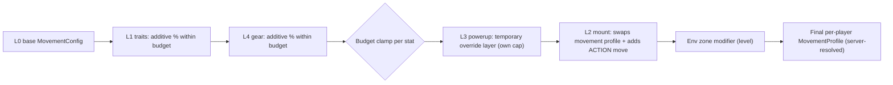

# Super BoundHaven: abilities taxonomy and skill tree (detail)

Companion to `GAME_DESIGN_DOCUMENT.md` (sections 2, 3, 4, 6).

**Decision 2026-09-30 [CONFIRMED by Bacon Spaceman]:** the skill model is **both** a skill-point tree (Model A) **and** mastery-by-use unlocks (Model B), with **free respecs**. Section 6 defines how they coexist. Detail numbers (costs, caps, slot counts) remain **[PROPOSAL]** tuning values. Build order (mastery layer first, tree overlay after) is **[ACCEPTED-DELEGATED]**.

Badges: **[CONFIRMED]** = Bacon Spaceman's own words (brief, decisions log, 2026-09-30 answers); **[ACCEPTED-DELEGATED]** = Claude chose by Bacon Spaceman's delegation, revisable any time; **[PROPOSAL]** = Claude's design suggestion; **[OPEN]** = unresolved.

Reference numbers come from `packages/sim/src/config.ts` (60 Hz, 16 px tiles, hitbox 12x16). Heights and distances are continuous-physics approximations derived from those values; verify against sim tests before tuning anything to them.

---

## 1. Hard rules the tree and abilities must obey

| # | Rule | Status | Source / reason |
|---|---|---|---|
| R1 | Hard content must be possible with the **base moveset** at exceptional skill. | **[CONFIRMED]** | DESIGN_BRIEF "Items, builds, and economy" |
| R2 | Gear/abilities add flair and meaningfully **ease** hard content; they do not replace skill. | **[CONFIRMED]** | DESIGN_BRIEF |
| R3 | Nothing purchasable with real money grants movement or ability power (no pay-to-win). Skill points and mastery are never sold or traded. | **[ACCEPTED-DELEGATED]** 2026-09-30 | DECISIONS "No paid power" |
| R4 | No node/gear/powerup may make a **required** route impossible without it. Required routes are base-clearable (with the team, for co-op). | **[PROPOSAL]** | extends R1 |
| R5 | Competitive play runs under an explicit **ruleset** (Open / Standard / Classic). Classic = base moveset only (normalized/unequipped leaderboard). | **[ACCEPTED-DELEGATED]** 2026-09-30 | DECISIONS rulesets |
| R9 | Respec is **free**: no currency, instant, never lossy. | **[CONFIRMED]** 2026-09-30 | Bacon Spaceman: free redos if you don't like your build |
| R10 | The tree and mastery never gate mount acquisition (mounts are earned via friendly questlines). | **[ACCEPTED-DELEGATED]** | difficulty pillar D2 |
| R6 | Every movement-affecting bonus is **capped** by the Movement Budget (section 5). | **[PROPOSAL]** | fairness |
| R7 | Mounts, abilities and gates are **never acquired from the tree or shop in a way that hard-locks progress**. | **[PROPOSAL]** | MOUNTS doc guardrail |
| R8 | All designs, names and effects are original. No mushrooms, capes/feathers, stars-as-invincibility, fire flowers, tongue-eats-enemy, etc. | **[CONFIRMED]** (originality) | brief + ART_NORTH_STAR |

---

## 2. Ability taxonomy (the five layers plus environment)

| Layer | What it is | Acquired by | Lifetime | Persistence | Competitive default |
|---|---|---|---|---|---|
| **L0 Base move** | Run, jump, stomp-bounce etc. Everyone, always. | Existing from first join | Permanent | none needed | Always on (all rulesets) |
| **L1 Trait** | Small permanent account-wide bonus or convenience (from the tree in Model A, or from mastery unlocks in Model B). | Points (A) or by-doing (B) | Permanent, swappable | account | Movement-affecting traits off in Classic |
| **L2 Mount ability** | Extra moves while mounted (frog super-hop, cheetah dash...). | Mount owned + summoned | While mounted | mount roster on account | Per-level/ruleset mount policy |
| **L3 Powerup** | Consumable, temporary (charges or seconds). | Found in levels, crafted, dropped, bought with earned currency | Seconds/charges | inventory count only | Off in Standard/Classic; fixed, level-provided pickups allowed in any ruleset |
| **L4 Gear effect** | Passive stat from worn equipment, bounded by budget. | Loot, crafting, trade | While worn | inventory/loadout | Off in Classic; capped in Standard |
| **Env (not an ability)** | Zone modifiers: low gravity, ice, water, wind. Affect everyone equally. | Level data | In zone | none | Always on (part of the level) |

### Stacking and conflict

1. **Resolve server-side** into one immutable `MovementProfile` per player per attempt. The sim's `stepPlayer(level, p, buttons, cfg)` already takes a `cfg`, so a per-player profile fits without new architecture.
2. **Within a layer**, percentage bonuses are additive, then clamped by the Movement Budget. **Across layers**, the order above applies; the final value is clamped by a hard per-stat ceiling.
3. **Conflicts:** same-stat powerups do not stack (refresh the longer timer, keep one). A mount replaces the body movement profile for the stats it defines (frog: jump arc; cheetah: speed) but traits/gear bonuses apply to mount stats only where listed. An active powerup that conflicts with a mount ability (e.g. glide on a flyer) is suspended, not stacked, while mounted (visible indicator).
4. **Ruleset mask:** the ruleset supplies a bitmask of allowed layers; the profile resolver zeroes disallowed layers. The match/attempt records the ruleset and profile hash so leaderboards can be audited.

### Rulesets [PROPOSAL]

| Ruleset | L1 traits | L3 powerups | L4 gear | L2 mount | Use |
|---|---|---|---|---|---|
| **Open** | all | all | all | per level | Casual overworld, raids, creator levels |
| **Standard** | non-movement + capped movement | level-provided only | capped | per level | Default race/time-attack board |
| **Classic** | non-movement only (map, ping, UI) | level-provided only | cosmetic only | level-provided loaner only | Normalized/unequipped leaderboard, "purist" runs |

---

## 3. Base moveset vs additions (what belongs where)

See GDD section 2 for the numbers. Summary of the **proposed growth of the base**:

| Move | State | Note |
|---|---|---|
| Walk/run, accel, skid, friction | **Exists in sim** | L0 |
| Variable jump, run-speed jump bonus, coyote (5 t), buffer (6 t) | **Exists in sim**; coyote/buffer kept as permanent base for everyone **[ACCEPTED-DELEGATED]** 2026-09-30 | L0 |
| Slopes, bounce pads, stomp-bounce, player push | **Exists in sim** | L0 |
| Crouch / drop through semi-solids (DOWN) | **[CONFIRMED]** 2026-09-30, to be added to sim (M4) | L0; semi-solids appear in the art north star |
| ACTION / Activate button (interact with switches, summon/dismount mount, use powerup, mount ability) | **[CONFIRMED]** 2026-09-30, to be added to sim (M4) | Interact is part of the base; mount/powerup uses are L2/L3. Never required for pure base-only movement routes except level-provided switches |
| Swim / water movement | **[PROPOSAL]** | zone-provided, same for all |

---

## 4. Skill tree, Model A: Points tree [part of the confirmed "both" model; numbers PROPOSAL]

### 4.1 Design goals

1. Give **build identity and long-term goals** without touching the skill ceiling.
2. Most nodes are **utility, information, expression and co-op/creator convenience**, not raw movement stats.
3. Movement-stat nodes are few, small and capped, and **vanish in Classic**.
4. Explore/co-op/create are all valid ways to grow (no single grind path).

### 4.2 Structure

| Element | Rule |
|---|---|
| Branches | **Footwork** (Mobility/Precision), **Bond** (Co-op/Support), **Wayfinder** (Explorer/Metroidvania), **Maker** (Creator/Builder), **Stablemaster** (Mount Mastery) + cross-branch **X** nodes |
| Node types | **S** Stat (tiny, capped), **U** Utility (new convenience), **I** Info (UI/readouts), **K** Keystone (tradeoff/toggle), **C** Cosmetic/Title |
| Movement flag | **M** = affects movement/ability numbers (suppressed in Classic, capped in Standard). **N** = non-movement (always allowed) |
| Points | "Skill Points" (name **[OPEN]**). Under the "both" model, SP come **only from Mastery tier milestones** (section 6), never directly from individual feats, so a feat is never paid twice. **Never sold, never traded.** No numeric earn rate promised. |
| Supply vs cost | Full tree costs **76 SP** in the sample below; proposed long-run supply is deliberately **below** full cost (target ~75%) so choices matter. Numbers are placeholders **[OPEN]** |
| Respec | **Free and instant [CONFIRMED]**: no currency, no cooldown, no point loss. Allowed any time you are out of combat, outside an active attempt, and not inside a raid encounter (so safe zones, overworld, between attempts, raid lobby). Loadout is **snapshotted when an event/raid attempt starts**. See section 6.3. |
| Loadout | Up to N "active keystones" at once (N=2 proposal). Unlimited passive nodes once purchased. |
| Caps | Movement Budget (section 5). Diminishing returns: rank II of a stat node gives the same % but costs more; no third rank. |
| Prerequisites | Tree edges (node A requires B); some cross-branch nodes need 1 node from 2 branches. |
| What the tree may NOT do | Unlock mounts; gate required content; grant raid-only immunities; sell anything; add HP/invulnerability; bypass sync mechanics; change leaderboard-visible physics in Classic; grant stacking beyond budget; give info that makes hidden content trivially skipped for first-time explorers (secret hints are opt-in and local). |

### 4.3 Sample tree (38 nodes, 76 SP)

Cost = SP. "Req" = prerequisite node(s). Flag M/N as above. Numeric effects are starting points, verify in sim.

#### Footwork (Mobility / Precision)

| ID | Node | Type | Flag | Effect | Req | SP |
|---|---|---|---|---|---|---|
| F1 | Ledge Sense | I | N | Soft landing-shadow marker under your feet while airborne (toggle) | none | 1 |
| F2 | Ghost Replay | U | N | Race your own best attempt as a ghost in any level | F1 | 1 |
| F3 | Spring Legs I/II | S | M | +2.5% jump velocity per rank (total +5% ≈ +0.6 tile at full hold) | F1 | 2 + 2 |
| F4 | Sure Stride I/II | S | M | +2.5% run max per rank (total +5%) | F1 | 2 + 2 |
| F5 | Steady Air | S | M | +8% air acceleration | F3 | 2 |
| F6 | Bounce Sense | U | M | Held-jump window on pads and stomps starts 4 ticks early (more forgiving input, same heights) | F2 | 2 |
| F7 | Purist Mark | K | N | Toggle: all M nodes and gear movement stats off; run is auto-tagged "Purist" on boards; grants a badge cosmetic. Costs 1 to unlock. Exists to make self-normalized play rewarding | F1 | 1 |

#### Bond (Co-op / Support)

| ID | Node | Type | Flag | Effect | Req | SP |
|---|---|---|---|---|---|---|
| B1 | Ping Wheel | U | N | Contextual pings (go, wait, switch, bounce here) | none | 1 |
| B2 | Steady Base | S | M | Take 30% less downward push when stomped (easier to be a stable step) | B1 | 1 |
| B3 | Bounce Glow | I | N | Highlight on an ally when their stomp window lines up with yours | B1 | 1 |
| B4 | Anchor Grip | U | M | Hold ACTION: immovable by pushes for 1 s (cooldown 4 s) | B2 | 2 |
| B5 | Rally Call | U | N | Channel 3 s to return a fallen ally to your position (cooldown 60 s, not usable in Classic runs) | B3 | 3 |
| B6 | Hand-off | U | N | Pass one powerup to an adjacent ally | B1 | 2 |
| B7 | Countdown Call | U | N | Place a synchronized, server-timed countdown everyone in the party sees (helps sync mechanics; does not change windows) | B5 | 3 |

#### Wayfinder (Explorer / Metroidvania)

| ID | Node | Type | Flag | Effect | Req | SP |
|---|---|---|---|---|---|---|
| W1 | Cartographer's Eye | I | N | Larger auto-reveal radius on the map | none | 1 |
| W2 | Secret Sense | I | N | Subtle shimmer near secrets within ~6 tiles (toggle; default-on accessibility option planned independent of the tree, **[OPEN]**) | W1 | 1 |
| W3 | Trail Pins | U | N | Place up to 3 map pins | W1 | 1 |
| W4 | Haven Return | U | N | Fast-travel between **visited** waypoints (cooldown, not in instances) | W1 | 2 |
| W5 | Lantern Lore | I | N | Hollow Lantern powerup reveals twice the radius | W2 | 2 |
| W6 | Secret Ledger | I | N | Per-zone secret counters plus vague text hints | W2 | 1 |
| W7 | Pathfinder's Promise | K | N | If you are stuck at a mount/ability gate, the map highlights the nearest way to obtain the answer (mount source or alternate route). Anti-hard-lock safety net | W4 | 3 |

#### Maker (Creator / Builder)

| ID | Node | Type | Flag | Effect | Req | SP |
|---|---|---|---|---|---|---|
| K1 | Steady Hand | U | N | Deeper undo history, grid-snap presets | none | 1 |
| K2 | Stamp Library | U | N | Save/paste tile stamps | K1 | 1 |
| K3 | Playtest Ghosts | I | N | See anonymized tester ghosts in your draft levels | K1 | 2 |
| K4 | Validator Insight | I | N | Visualize the base-moveset route proof and failure hotspots | K2 | 2 |
| K5 | Scenery Sets | C | N | Extra decoration sets (cosmetic only; core tile palette is free for everyone) | K1 | 2 |
| K6 | Event Host | U | N | Host private race/time-attack lobbies on approved levels | K4 | 3 |
| K7 | Curator's Shelf | C | N | Pin 3 favorite levels on your profile | K1 | 1 |

#### Stablemaster (Mount Mastery)

Requires owning at least one mount for any node here to be useful; mount **acquisition is never in the tree**.

| ID | Node | Type | Flag | Effect | Req | SP |
|---|---|---|---|---|---|---|
| M1 | Stable Keys | S | M | Mount summon cooldown -15% | none | 2 |
| M2 | Quick Saddle | S | M | Faster mount-on/off animation (no extra invulnerability) | M1 | 1 |
| M3 | Stamina Reserve | S | M | +10% mount stamina (flyer, cheetah) | M1 | 2 |
| M4 | Long Reach | S | M | Frog tether reach +1 tile | M1 | 2 |
| M5 | Hardy Hide | S | M | Mount tolerates one more stun/bump before dismount (only if a mount-health model exists, **[OPEN]**) | M1 | 2 |
| M6 | Passenger Seat | U | M | Mount may carry one passenger (only if passengers are approved, **[OPEN]**) | M3 | 3 |
| M7 | Bonded Mount | K | M | Choose one bonded mount: its ability cooldown -20%, other mounts +15% | M3 | 3 |

#### Cross-branch (X)

| ID | Node | Type | Flag | Effect | Req | SP |
|---|---|---|---|---|---|---|
| X1 | Spare Loadout | U | N | +3 extra preset slots (base game already gives 3, see 6.3) | F2 and W1 | 2 |
| X2 | Hybrid Stride | S | M | Powerup durations +10% (Open ruleset only) | F4 and M1 | 3 |
| X3 | Haven Sage | C | N | Capstone: title and aura cosmetic, no power | >= 3 nodes in each of 4 branches | 5 |

**Totals:** Footwork 15, Bond 13, Wayfinder 11, Maker 12, Stablemaster 15, X 10 = **76 SP**, 38 nodes.

---

## 5. Movement Budget (caps across tree + gear + powerups)

Applies to all sources combined. Values are starting proposals **[OPEN]**.

| Stat | Tree + gear cap (Open) | Standard | Classic | Powerup layer (Open only) | Hard ceiling |
|---|---|---|---|---|---|
| Jump velocity (height) | +10% (≈ +1.2 tile at the current ≈3.8-tile full hold) | +6% | 0 | +8% | +18% |
| Run max speed | +8% | +5% | 0 | +12% | +18% |
| Air acceleration | +15% | +8% | 0 | +20% | +30% |
| Bounce boost (pads/stomp) | +8% | +4% | 0 | +10% | +15% |
| Ground grip (friction/skid) | +20% | +10% | 0 | +30% | +40% |
| Mount stamina | +20% | +10% | 0 | n/a | +25% |
| Powerup duration | +15% | 0 | 0 | n/a | +15% |
| Coyote / buffer windows | 0 (assist setting, not a stat) | 0 | 0 | 0 | 0 |

Coyote time and jump buffering are **assist/feel settings shared by everyone**, not purchasable power, to keep fairness simple.

**Design-time gate margin:** level designers and the validator must treat required jumps as base-clearable with margin (e.g. required gap <= base run-jump distance minus a skill margin; the 6-tile co-op wall in the playground is deliberately *not* solo-clearable). Budget caps are sized so that a capped Open build clears optional challenges, never required routes, that base cannot.

---

## 6. Mastery-by-use and how it coexists with the points tree

**Decision [CONFIRMED 2026-09-30]:** both systems exist. Section 6.1 describes the mastery half, 6.2 the coexistence contract, 6.3 free respec and presets, 6.5 the original comparison (kept for reference).

### 6.1 Mastery-by-use (the "by doing" half)

**Unlock by doing.** Five tracks (same names as the tree branches). Each track has **Mastery Marks** earned by feats (first discovery, first clears, co-op completions, mount trials, creator milestones). Each track has tiers; reaching a tier auto-grants that tier's perk and its Skill Points. Mastery **perks** are the non-movement and information/utility kind (N/I/U nodes above) plus a *small* set of capped M perks. You **equip** up to N perks into "Trait Slots" (N grows slowly with mastery, e.g. 3 to 5); swap freely under the respec rules.

### 6.2 Coexistence contract (no double-dipping) [ACCEPTED-DELEGATED]

1. **One feat, one ledger entry.** A feat adds Mastery progress in exactly one track. It never also grants Skill Points directly.
2. **Skill Points come from Mastery tiers only.** Each tier milestone grants its perk plus a fixed number of SP. Total SP supply is below total tree cost (about 75%).
3. **Partitioned catalog.** A given effect lives in **either** the tree **or** the mastery perks, never both. Rule of thumb: convenience, info, expression, creator and quality-of-life effects (mostly N/I/U/C) are **mastery perks** unlocked by doing; build-shaping effects (capped stat nodes, keystones, tradeoffs, mount stat nodes) are **tree nodes** bought with SP. Where the sample tree above lists an N/I/U node, it is the mastery-perk catalog entry (the 1:1 mapping noted in the original design); where it lists S or K, it is a tree node.
4. **Perks do not stack with tree nodes** for the same stat: both draw from the **same Movement Budget** and the same per-stat ceiling (section 5).
5. **Trait Slots** (mastery) and **active keystone slots** (tree, N=2) are separate pools with separate limits; both count toward the ruleset mask.
6. **Mastery never spends or refunds.** Respec only touches Skill Point spends and slot assignments; mastery progress and earned perks are permanent.
7. **Mounts are not in either system.** Mastery/tree only tune mounts (stamina, cooldown, reach) after acquisition (R10).

### 6.3 Free respec and loadout presets [CONFIRMED respec; ACCEPTED-DELEGATED presets]

- **Respec is free and instant** ("free redos if you don't like your build"): refund all spent SP, reassign Trait Slots, change keystones; no currency, no cooldown, no point loss.
- **When allowed:** out of combat, outside an active attempt, not inside a raid encounter. Safe zones, the overworld, between attempts and the raid lobby all qualify.
- **Presets:** 3 free build-preset slots for everyone from the start, each storing tree spend, Trait Slots, keystones and gear loadout; X1 Spare Loadout adds 3 more. Presets are renameable and can be swapped under the same rules as respec.
- **Snapshots:** the loadout is snapshotted when an event, raid or ranked attempt starts, and recorded with a profile hash for leaderboards.
- **Classic ruleset:** movement-affecting perks and nodes are zeroed (normalized/unequipped board stays intact); Purist Mark (F7) remains.
- **Respec and fairness:** free respec is safe because every movement stat is capped by the Movement Budget and the base moveset is always sufficient for required routes.

### 6.4 Build order [ACCEPTED-DELEGATED]

Ship the mastery layer first (cheaper, less grindy), then add the points tree as an overlay using the same catalog. Both are live before either is declared "done"; neither is ever sold.

### 6.5 Original comparison (reference)

Earlier proposal compared the two as alternatives; Bacon Spaceman chose both, so the comparison now shows what each half contributes.

| Dimension | Model A: Points tree | Model B: Mastery-by-use |
|---|---|---|
| Player fantasy | Plan a build, spend currency | Get better/explore and be rewarded with new tools |
| Fits Metroidvania exploration | Medium (points from discoveries) | **High** (unlock is the discovery) |
| Risk of "wrong" choice / regret | Medium, mitigated by free respec | **Low** |
| Grind / point-farming risk | Medium (need an earn rate) | Low-Medium (feats are one-time; must avoid checklist fatigue) |
| Balance complexity | High (prereq graph, caps, costs) | **Lower** (flat perks, slot limit is the knob) |
| Build diversity | High | Medium (slots limit; fewer numeric options) |
| Dev cost (first version) | Higher UI + persistence + graph | **Lower** |
| Competitive fairness | Needs budget + ruleset | Same, but fewer stat perks so easier |
| Onboarding | Tree screen can overwhelm new players | Gentle |
| Extensibility ("no addition too small") | Add nodes (graph growth) | Add feats/perks (flat list growth) |
| Ties to brief | "tentative skill tree" | Consistent with secrets/exploration emphasis |

**Resolved 2026-09-30:** Bacon Spaceman chose both with free respecs. Build mastery (Model B) first and layer the points tree (Model A) over the same catalog, per 6.2 to 6.4.

---

## 7. Interactions cheat sheet

| Combination | Result |
|---|---|
| Tree/gear bonuses + mount | Apply only to mount stats explicitly listed (stamina, cooldown, reach); do not stack beyond mount ceiling |
| Powerup + mount ability | Conflicting powerups suspended while mounted; non-conflicting coexist |
| Powerup + powerup | One active timed movement powerup at a time; utility ones coexist |
| Gear + Purist Mark (F7) | Movement stats ignored while Purist is on |
| Classic ruleset | Only L0, non-movement L1, level-provided pickups, level-provided loaner mounts |
| Raids | Ruleset is Open unless the raid declares otherwise; raid declares mount policy (none/loaner/free) |
| Creator levels | Creator chooses allowed layers (mask) and can mark a level "Classic only" |
